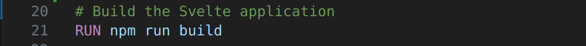
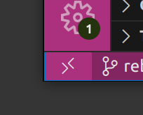

# Contributers

| Name           | Github         | Email                     |
| -------------- | -------------- | ------------------------- |
| Aidan Donnelly | AidanDonnelly1 | aido4381@colorado.edu     |
| Ishan Gohil    | IshanGProjects | ishan10.gohil@gmail.com   |
| Ari Guzzi      | ari-guzzi      | argu4451@colorado.edu     |
| Alex Savard    | asavy79        | alsa8624@colorado.edu     |
| Luke Wu        | lukewu1        | Luke.Wu@colorado.edu      |
| Eric David     | EricDavidd     | Eric.David@colorado.edu   |
| Alicia Zhang   | alzh42         | Alicia.Zhang@colorado.edu |

# Getting Started

### before starting look for any folders called "node_modules" if you see it DELETE IT.

0. Clone the github repo onto your local machine

1. Downlaod the "Dev Containers" extension for VSCode (ms-vscode-remote.remote-containers)

2. Open a new VS Code window and close all others. In this window open the repository folder. It is important you open the folder called Natural-Highs and not any other

3. Comment out this line in .devcontainer/Dockerfile

4. Click on the two angled brackets in the bottom left

5. Click Reopen in Container

 6. VSCode Should reopen from inside your docker container

7. Run `bun install` in the terminal

8. create a file called .env and paste the contents from the pinned message in discord in

9. run `bun run dev` in the terminal

10. click on the local host link in your terminal and if you are brought to a log in page then every thing is working.

11. Make sure to uncomment that line in the Dockerfile after everything starts working

### Optional: Install the Peacock extension (johnpapa.vscode-peacock) to "Subtly change the color of your Visual Studio Code workspace."

# Starting the Project

1. Start the emulator with `bunx firebase-tools emulators:start`
2. If you have any errors try `bun install -g firebase-tools@latest` and `apt install -y default-jdk` then rerun the command
3. You can now connect to http://127.0.0.1:4000/ to view a ui for the db and auth
4. `bun run dev` to start the project locally (Vite serves on port 5174 by default)
5. You can now connect to the local URL printed in the terminal to verify the login page
