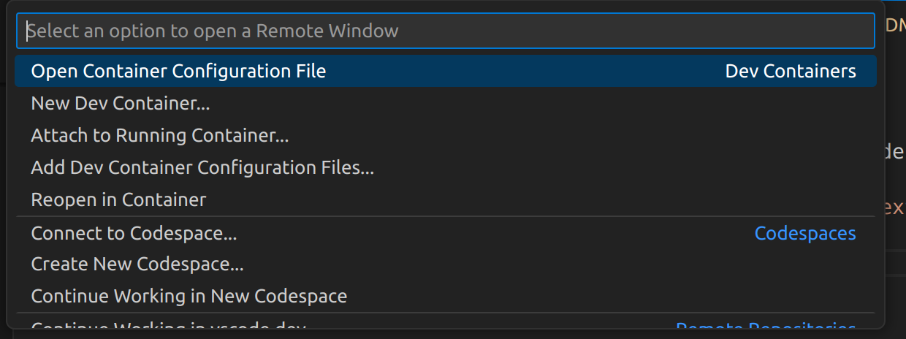

# Connecting to Docker

1. Downlaod the "Dev Containers" extension for VSCode (ms-vscode-remote.remote-containers)
2. Click on the two angled brackets in the bottom left 

3. Click Reopen in Container 

4.w VSCode Should reopen from inside your docker container

### Optional: Install the Peacock extension (johnpapa.vscode-peacock) to "Subtly change the color of your Visual Studio Code workspace."