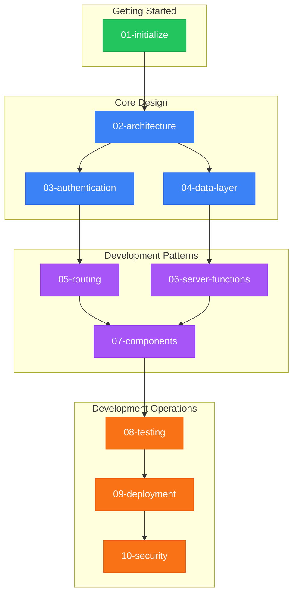

# Natural Highs

> **TL;DR**: `bun install && bun run setup && bun run dev` to start. See [Initialize](01-initialize) for full setup.

## Documentation Map

## Documents

| # | Document | Summary |
|---|----------|---------|
| 00 | [Visual Overview](00-overview) | Architecture diagrams |
| 01 | [Initialize](01-initialize) | Setup, commands, structure |
| 02 | [Architecture](02-architecture) | System design, tech stack |
| 03 | [Authentication](03-authentication) | Auth flows, sessions, passkeys |
| 04 | [Data Layer](04-data-layer) | Firebase, Firestore patterns |
| 05 | [Routing](05-routing) | File-based routes, guards |
| 06 | [Server Functions](06-server-functions) | RPC patterns, middleware |
| 07 | [Components](07-components) | UI organization, patterns |
| 08 | [Testing](08-testing) | Vitest, Playwright |
| 09 | [Deployment](09-deployment) | CI/CD, Netlify, Doppler |
| 10 | [Security](10-security) | Threat model, mitigations |

## Reading Paths

| Role | Path |
|------|------|
| New contributor | [Initialize](01-initialize) → [Architecture](02-architecture) |
| Frontend | Initialize → Architecture → [Routing](05-routing) → [Components](07-components) |
| Backend | Initialize → Architecture → [Authentication](03-authentication) → [Data Layer](04-data-layer) → [Server Functions](06-server-functions) |
| DevOps | Initialize → Architecture → [Deployment](09-deployment) → [Security](10-security) |

## Stack

**Framework**: TanStack Start (React 19) with file-based routing and server functions
**Backend**: Firebase Auth + Firestore
**Infrastructure**: Netlify (hosting) + Doppler (secrets)
**Testing**: Vitest (unit) + Playwright (E2E)

---

_Next: [Initialize](01-initialize)_
