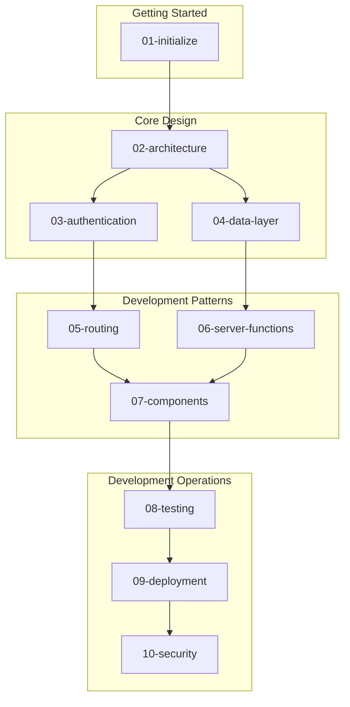

# Natural Highs

[](https://app.netlify.com/sites/naturalhighs/deploys)
[](https://github.com/Natural-Highs/live/actions/workflows/pr-checks.yml)
[](https://codecov.io/gh/Natural-Highs/live)

## Quick Start

```bash
bun install
bun run setup          # Configure Doppler secrets
bun run dev            # Start development server
```

## Documentation Map



## Document Index

| Doc | Title | Audience | Purpose |
|-----|-------|----------|---------|
| [01](01-initialize) | Initialize | All | Clone, setup, run locally |
| [02](02-architecture) | Architecture | All | System overview, tech stack |
| [03](03-authentication) | Authentication | Backend | Auth flows, sessions, passkeys |
| [04](04-data-layer) | Data Layer | Backend | Firebase, Firestore patterns |
| [05](05-routing) | Routing | Frontend | File-based routes, guards |
| [06](06-server-functions) | Server Functions | Backend | RPC patterns, middleware |
| [07](07-components) | Components | Frontend | UI organization, patterns |
| [08](08-testing) | Testing | All | Vitest, Playwright setup |
| [09](09-deployment) | Deployment | DevOps | CI/CD, Netlify, Doppler |
| [10](10-security) | Security | All | Threat model, mitigations |

## Reading Paths

**New contributor:**
1. [Initialize](01-initialize) - Get running locally
2. [Architecture](02-architecture) - Understand the system

**Frontend:**
1. Initialize → Architecture → [Routing](05-routing) → [Components](07-components)

**Backend:**
1. Initialize → Architecture → [Authentication](03-authentication) → [Data Layer](04-data-layer) → [Server Functions](06-server-functions)

**DevOps:**
1. Initialize → [Deployment](09-deployment) → [Security](10-security)

## Technology Stack

| Layer | Technology |
|-------|------------|
| Framework | TanStack Start (React 19) |
| Routing | TanStack Router (file-based) |
| State | TanStack Query |
| Forms | TanStack Form + Zod |
| Backend | Firebase (Auth + Firestore) |
| Hosting | Netlify |
| Secrets | Doppler |
| Testing | Vitest + Playwright |

## Commands Reference

```bash
# Setup
bun install
bun run setup          # Configure Doppler

# Development
bun run dev            # Start with secrets
bun run emulators      # Firebase emulators

# Quality
bun run lint           # Check code
bun run test           # Unit tests (watch)
bun run test:e2e       # E2E tests (UI)

# Build
bun run build          # Production build
```

## Project Structure

```text
src/
├── routes/            # File-based routing
├── components/        # React components
│   ├── ui/           # Primitives (shadcn)
│   ├── forms/        # Form components
│   └── auth/         # Auth UI
├── server/
│   ├── functions/    # Server functions (RPC)
│   ├── middleware/   # Auth guards
│   └── schemas/      # Zod validation
├── lib/
│   ├── firebase/     # Firebase clients
│   ├── session.ts    # Session management
│   └── queries/      # TanStack Query
└── context/          # React contexts
```

## Visual Overview

For system architecture diagrams and visual references, see the [Visual Overview](00-overview).

---

_Next: [Initialize](01-initialize)_
