# Natural Highs Repo Overview

## How to Update

1. Save any changes in project root `src/` to be rendered
   - `docs/diagrams/src/` is root `*.puml` equivalent
2. Run `npm run docs:puml`
   - rebuilds`.puml` sources
   - refreshes PNG previews
   - rewrites the catalog below
3. Verify updated sections are successful
4. Commit modified files (auto-formatted .md), push branch, open/merge PR

## Diagram Catalog

<!-- DIAGRAM-LIST:START -->

src (root) (5 diagrams)

| Diagram         | Preview                                     | Details                                                                                                                   |
| --------------- | ------------------------------------------- | ------------------------------------------------------------------------------------------------------------------------- |
| app.css         | 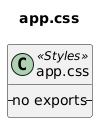                 | Source: [`src/app.css.puml`](src/app.css.puml) Diagram ID: `app_css` Stereotype: `Styles`                         |
| app.d.ts        | 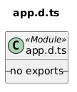               | Source: [`src/app.d.ts.puml`](src/app.d.ts.puml) Diagram ID: `app_d_ts` Stereotype: `Module`                      |
| app.html        | 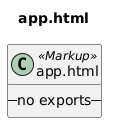               | Source: [`src/app.html.puml`](src/app.html.puml) Diagram ID: `app_html` Stereotype: `Markup`                      |
| hooks.server.ts | 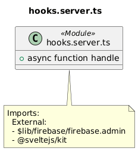 | Source: [`src/hooks.server.ts.puml`](src/hooks.server.ts.puml) Diagram ID: `hooks_server_ts` Stereotype: `Module` |
| index.test.ts   | 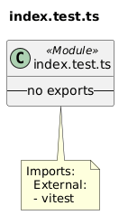     | Source: [`src/index.test.ts.puml`](src/index.test.ts.puml) Diagram ID: `index_test_ts` Stereotype: `Module`       |

src/lib (4 diagrams)

| Diagram            | Preview                                                 | Details                                                                                                                             |
| ------------------ | ------------------------------------------------------- | ----------------------------------------------------------------------------------------------------------------------------------- |
| lib/index.ts       | 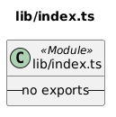             | Source: [`src/lib/index.ts.puml`](src/lib/index.ts.puml) Diagram ID: `lib__index_ts` Stereotype: `Module`                   |
| lib/qr-code.ts     | 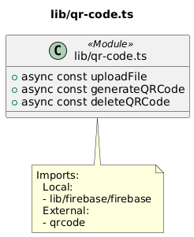         | Source: [`src/lib/qr-code.ts.puml`](src/lib/qr-code.ts.puml) Diagram ID: `lib__qr_code_ts` Stereotype: `Module`             |
| lib/redisConfig.js | 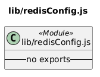 | Source: [`src/lib/redisConfig.js.puml`](src/lib/redisConfig.js.puml) Diagram ID: `lib__redisConfig_js` Stereotype: `Module` |
| lib/sample.spec.ts | 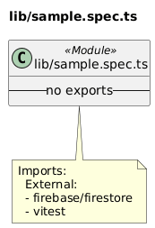 | Source: [`src/lib/sample.spec.ts.puml`](src/lib/sample.spec.ts.puml) Diagram ID: `lib__sample_spec_ts` Stereotype: `Module` |

src/lib/db (1 diagram)

| Diagram        | Preview                                              | Details                                                                                                                  |
| -------------- | ---------------------------------------------------- | ------------------------------------------------------------------------------------------------------------------------ |
| lib/db/auth.ts | 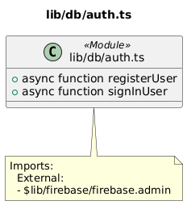 | Source: [`src/lib/db/auth.ts.puml`](src/lib/db/auth.ts.puml) Diagram ID: `lib__db__auth_ts` Stereotype: `Module` |

src/lib/firebase (3 diagrams)

| Diagram                        | Preview                                                                                    | Details                                                                                                                                                                  |
| ------------------------------ | ------------------------------------------------------------------------------------------ | ------------------------------------------------------------------------------------------------------------------------------------------------------------------------ |
| lib/firebase/firebase.admin.ts | 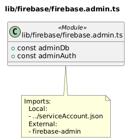 | Source: [`src/lib/firebase/firebase.admin.ts.puml`](src/lib/firebase/firebase.admin.ts.puml) Diagram ID: `lib__firebase__firebase_admin_ts` Stereotype: `Module` |
| lib/firebase/firebase.app.ts   | 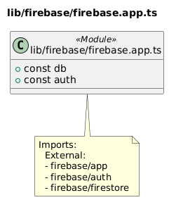     | Source: [`src/lib/firebase/firebase.app.ts.puml`](src/lib/firebase/firebase.app.ts.puml) Diagram ID: `lib__firebase__firebase_app_ts` Stereotype: `Module`       |
| lib/firebase/firebase.ts       | 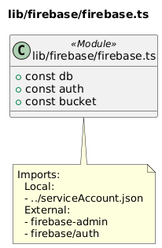             | Source: [`src/lib/firebase/firebase.ts.puml`](src/lib/firebase/firebase.ts.puml) Diagram ID: `lib__firebase__firebase_ts` Stereotype: `Module`                   |

src/lib/utils (1 diagram)

| Diagram                    | Preview                                                                         | Details                                                                                                                                                      |
| -------------------------- | ------------------------------------------------------------------------------- | ------------------------------------------------------------------------------------------------------------------------------------------------------------ |
| lib/utils/firebaseCalls.ts | 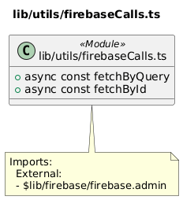 | Source: [`src/lib/utils/firebaseCalls.ts.puml`](src/lib/utils/firebaseCalls.ts.puml) Diagram ID: `lib__utils__firebaseCalls_ts` Stereotype: `Module` |

src/routes (4 diagrams)

| Diagram                | Preview                                                          | Details                                                                                                                                                 |
| ---------------------- | ---------------------------------------------------------------- | ------------------------------------------------------------------------------------------------------------------------------------------------------- |
| routes/+layout.svelte  | 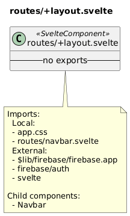   | Source: [`src/routes/+layout.svelte.puml`](src/routes/+layout.svelte.puml) Diagram ID: `routes__layout_svelte` Stereotype: `SvelteComponent`    |
| routes/+page.server.ts | 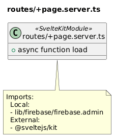 | Source: [`src/routes/+page.server.ts.puml`](src/routes/+page.server.ts.puml) Diagram ID: `routes__page_server_ts` Stereotype: `SvelteKitModule` |
| routes/+page.svelte    | 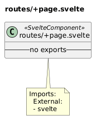       | Source: [`src/routes/+page.svelte.puml`](src/routes/+page.svelte.puml) Diagram ID: `routes__page_svelte` Stereotype: `SvelteComponent`          |
| routes/navbar.svelte   | 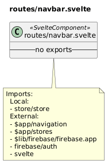   | Source: [`src/routes/navbar.svelte.puml`](src/routes/navbar.svelte.puml) Diagram ID: `routes__navbar_svelte` Stereotype: `SvelteComponent`      |

src/routes/admin (4 diagrams)

| Diagram                        | Preview                                                                                  | Details                                                                                                                                                                          |
| ------------------------------ | ---------------------------------------------------------------------------------------- | -------------------------------------------------------------------------------------------------------------------------------------------------------------------------------- |
| routes/admin/+layout.server.ts | 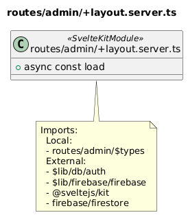 | Source: [`src/routes/admin/+layout.server.ts.puml`](src/routes/admin/+layout.server.ts.puml) Diagram ID: `routes__admin__layout_server_ts` Stereotype: `SvelteKitModule` |
| routes/admin/+layout.svelte    | 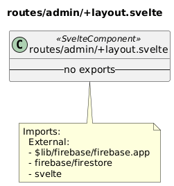       | Source: [`src/routes/admin/+layout.svelte.puml`](src/routes/admin/+layout.svelte.puml) Diagram ID: `routes__admin__layout_svelte` Stereotype: `SvelteComponent`          |
| routes/admin/+page.server.ts   | 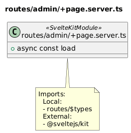     | Source: [`src/routes/admin/+page.server.ts.puml`](src/routes/admin/+page.server.ts.puml) Diagram ID: `routes__admin__page_server_ts` Stereotype: `SvelteKitModule`       |
| routes/admin/+page.svelte      | 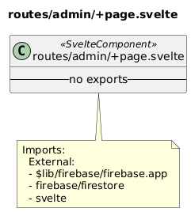           | Source: [`src/routes/admin/+page.svelte.puml`](src/routes/admin/+page.svelte.puml) Diagram ID: `routes__admin__page_svelte` Stereotype: `SvelteComponent`                |

src/routes/admin/charts (1 diagram)

| Diagram                          | Preview                                                                                               | Details                                                                                                                                                                                 |
| -------------------------------- | ----------------------------------------------------------------------------------------------------- | --------------------------------------------------------------------------------------------------------------------------------------------------------------------------------------- |
| routes/admin/charts/+page.svelte |  | Source: [`src/routes/admin/charts/+page.svelte.puml`](src/routes/admin/charts/+page.svelte.puml) Diagram ID: `routes__admin__charts__page_svelte` Stereotype: `SvelteComponent` |

src/routes/admin/qrCode (3 diagrams)

| Diagram                              | Preview                                                                                                         | Details                                                                                                                                                                                              |
| ------------------------------------ | --------------------------------------------------------------------------------------------------------------- | ---------------------------------------------------------------------------------------------------------------------------------------------------------------------------------------------------- |
| routes/admin/qrCode/+page.server.ts  | 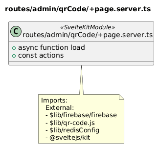     | Source: [`src/routes/admin/qrCode/+page.server.ts.puml`](src/routes/admin/qrCode/+page.server.ts.puml) Diagram ID: `routes__admin__qrCode__page_server_ts` Stereotype: `SvelteKitModule`     |
| routes/admin/qrCode/+page.svelte     | 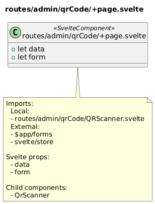           | Source: [`src/routes/admin/qrCode/+page.svelte.puml`](src/routes/admin/qrCode/+page.svelte.puml) Diagram ID: `routes__admin__qrCode__page_svelte` Stereotype: `SvelteComponent`              |
| routes/admin/qrCode/QRScanner.svelte | 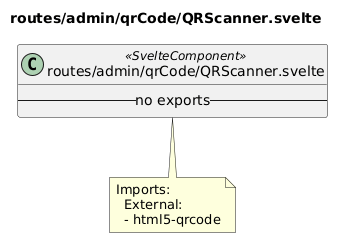 | Source: [`src/routes/admin/qrCode/QRScanner.svelte.puml`](src/routes/admin/qrCode/QRScanner.svelte.puml) Diagram ID: `routes__admin__qrCode__QRScanner_svelte` Stereotype: `SvelteComponent` |

src/routes/admin/survey (2 diagrams)

| Diagram                             | Preview                                                                                                     | Details                                                                                                                                                                                          |
| ----------------------------------- | ----------------------------------------------------------------------------------------------------------- | ------------------------------------------------------------------------------------------------------------------------------------------------------------------------------------------------ |
| routes/admin/survey/+page.server.ts | 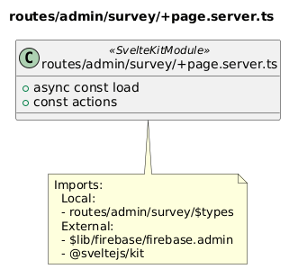 | Source: [`src/routes/admin/survey/+page.server.ts.puml`](src/routes/admin/survey/+page.server.ts.puml) Diagram ID: `routes__admin__survey__page_server_ts` Stereotype: `SvelteKitModule` |
| routes/admin/survey/+page.svelte    | 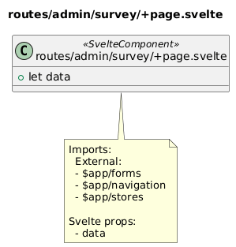       | Source: [`src/routes/admin/survey/+page.svelte.puml`](src/routes/admin/survey/+page.svelte.puml) Diagram ID: `routes__admin__survey__page_svelte` Stereotype: `SvelteComponent`          |

src/routes/admin/survey/[id] (3 diagrams)

| Diagram                                         | Preview                                                                                                                                    | Details                                                                                                                                                                                                                               |
| ----------------------------------------------- | ------------------------------------------------------------------------------------------------------------------------------------------ | ------------------------------------------------------------------------------------------------------------------------------------------------------------------------------------------------------------------------------------- |
| routes/admin/survey/[id]/+page.server.ts        |                  | Source: [`src/routes/admin/survey/[id]/+page.server.ts.puml`](src/routes/admin/survey/[id]/+page.server.ts.puml) Diagram ID: `routes__admin__survey__id___page_server_ts` Stereotype: `SvelteKitModule`                       |
| routes/admin/survey/[id]/+page.svelte           | 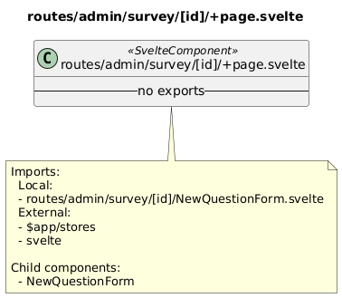                       | Source: [`src/routes/admin/survey/[id]/+page.svelte.puml`](src/routes/admin/survey/[id]/+page.svelte.puml) Diagram ID: `routes__admin__survey__id___page_svelte` Stereotype: `SvelteComponent`                                |
| routes/admin/survey/[id]/NewQuestionForm.svelte | 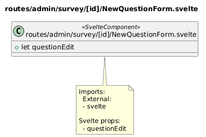 | Source: [`src/routes/admin/survey/[id]/NewQuestionForm.svelte.puml`](src/routes/admin/survey/[id]/NewQuestionForm.svelte.puml) Diagram ID: `routes__admin__survey__id___NewQuestionForm_svelte` Stereotype: `SvelteComponent` |

src/routes/api/adminSurvey (1 diagram)

| Diagram                           | Preview                                                                                                    | Details                                                                                                                                                                                      |
| --------------------------------- | ---------------------------------------------------------------------------------------------------------- | -------------------------------------------------------------------------------------------------------------------------------------------------------------------------------------------- |
| routes/api/adminSurvey/+server.ts | 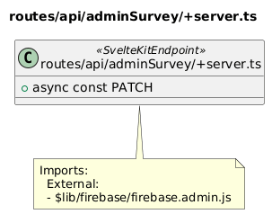 | Source: [`src/routes/api/adminSurvey/+server.ts.puml`](src/routes/api/adminSurvey/+server.ts.puml) Diagram ID: `routes__api__adminSurvey__server_ts` Stereotype: `SvelteKitEndpoint` |

src/routes/api/initialSurvey (1 diagram)

| Diagram                             | Preview                                                                                                          | Details                                                                                                                                                                                            |
| ----------------------------------- | ---------------------------------------------------------------------------------------------------------------- | -------------------------------------------------------------------------------------------------------------------------------------------------------------------------------------------------- |
| routes/api/initialSurvey/+server.ts | 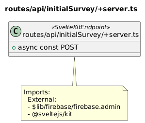 | Source: [`src/routes/api/initialSurvey/+server.ts.puml`](src/routes/api/initialSurvey/+server.ts.puml) Diagram ID: `routes__api__initialSurvey__server_ts` Stereotype: `SvelteKitEndpoint` |

src/routes/api/login (1 diagram)

| Diagram                     | Preview                                                                                  | Details                                                                                                                                                                    |
| --------------------------- | ---------------------------------------------------------------------------------------- | -------------------------------------------------------------------------------------------------------------------------------------------------------------------------- |
| routes/api/login/+server.ts | 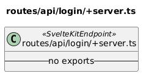 | Source: [`src/routes/api/login/+server.ts.puml`](src/routes/api/login/+server.ts.puml) Diagram ID: `routes__api__login__server_ts` Stereotype: `SvelteKitEndpoint` |

src/routes/api/logout (1 diagram)

| Diagram                      | Preview                                                                                     | Details                                                                                                                                                                       |
| ---------------------------- | ------------------------------------------------------------------------------------------- | ----------------------------------------------------------------------------------------------------------------------------------------------------------------------------- |
| routes/api/logout/+server.ts | 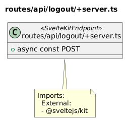 | Source: [`src/routes/api/logout/+server.ts.puml`](src/routes/api/logout/+server.ts.puml) Diagram ID: `routes__api__logout__server_ts` Stereotype: `SvelteKitEndpoint` |

src/routes/api/sessionLogin (1 diagram)

| Diagram                            | Preview                                                                                                       | Details                                                                                                                                                                                         |
| ---------------------------------- | ------------------------------------------------------------------------------------------------------------- | ----------------------------------------------------------------------------------------------------------------------------------------------------------------------------------------------- |
| routes/api/sessionLogin/+server.ts | 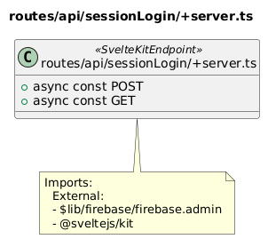 | Source: [`src/routes/api/sessionLogin/+server.ts.puml`](src/routes/api/sessionLogin/+server.ts.puml) Diagram ID: `routes__api__sessionLogin__server_ts` Stereotype: `SvelteKitEndpoint` |

src/routes/api/surveyQuestions (1 diagram)

| Diagram                               | Preview                                                                                                                | Details                                                                                                                                                                                                  |
| ------------------------------------- | ---------------------------------------------------------------------------------------------------------------------- | -------------------------------------------------------------------------------------------------------------------------------------------------------------------------------------------------------- |
| routes/api/surveyQuestions/+server.ts | 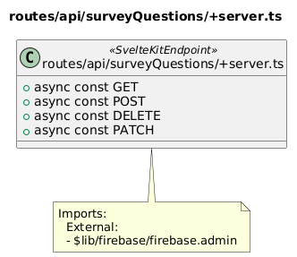 | Source: [`src/routes/api/surveyQuestions/+server.ts.puml`](src/routes/api/surveyQuestions/+server.ts.puml) Diagram ID: `routes__api__surveyQuestions__server_ts` Stereotype: `SvelteKitEndpoint` |

src/routes/api/surveys (1 diagram)

| Diagram                       | Preview                                                                                        | Details                                                                                                                                                                          |
| ----------------------------- | ---------------------------------------------------------------------------------------------- | -------------------------------------------------------------------------------------------------------------------------------------------------------------------------------- |
| routes/api/surveys/+server.ts | 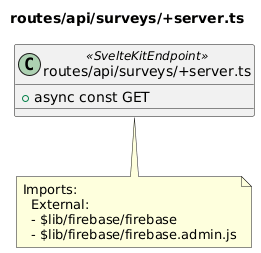 | Source: [`src/routes/api/surveys/+server.ts.puml`](src/routes/api/surveys/+server.ts.puml) Diagram ID: `routes__api__surveys__server_ts` Stereotype: `SvelteKitEndpoint` |

src/routes/api/userResponses (1 diagram)

| Diagram                             | Preview                                                                                                          | Details                                                                                                                                                                                            |
| ----------------------------------- | ---------------------------------------------------------------------------------------------------------------- | -------------------------------------------------------------------------------------------------------------------------------------------------------------------------------------------------- |
| routes/api/userResponses/+server.ts | 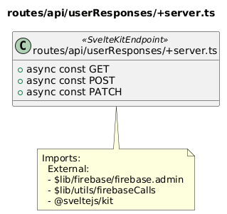 | Source: [`src/routes/api/userResponses/+server.ts.puml`](src/routes/api/userResponses/+server.ts.puml) Diagram ID: `routes__api__userResponses__server_ts` Stereotype: `SvelteKitEndpoint` |

src/routes/api/users (1 diagram)

| Diagram                     | Preview                                                                                  | Details                                                                                                                                                                    |
| --------------------------- | ---------------------------------------------------------------------------------------- | -------------------------------------------------------------------------------------------------------------------------------------------------------------------------- |
| routes/api/users/+server.ts | 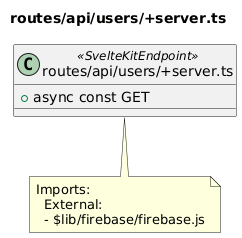 | Source: [`src/routes/api/users/+server.ts.puml`](src/routes/api/users/+server.ts.puml) Diagram ID: `routes__api__users__server_ts` Stereotype: `SvelteKitEndpoint` |

src/routes/authentication (6 diagrams)

| Diagram                                   | Preview                                                                                                                   | Details                                                                                                                                                                                                     |
| ----------------------------------------- | ------------------------------------------------------------------------------------------------------------------------- | ----------------------------------------------------------------------------------------------------------------------------------------------------------------------------------------------------------- |
| routes/authentication/+layout.svelte      | 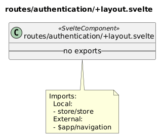             | Source: [`src/routes/authentication/+layout.svelte.puml`](src/routes/authentication/+layout.svelte.puml) Diagram ID: `routes__authentication__layout_svelte` Stereotype: `SvelteComponent`          |
| routes/authentication/+page.server.ts     | 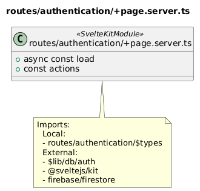           | Source: [`src/routes/authentication/+page.server.ts.puml`](src/routes/authentication/+page.server.ts.puml) Diagram ID: `routes__authentication__page_server_ts` Stereotype: `SvelteKitModule`       |
| routes/authentication/+page.svelte        | 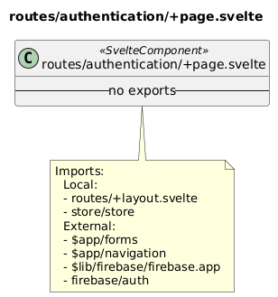                 | Source: [`src/routes/authentication/+page.svelte.puml`](src/routes/authentication/+page.svelte.puml) Diagram ID: `routes__authentication__page_svelte` Stereotype: `SvelteComponent`                |
| routes/authentication/firebase-debug.log  | 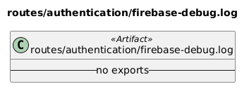   | Source: [`src/routes/authentication/firebase-debug.log.puml`](src/routes/authentication/firebase-debug.log.puml) Diagram ID: `routes__authentication__firebase_debug_log` Stereotype: `Artifact`    |
| routes/authentication/firestore-debug.log | 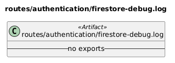 | Source: [`src/routes/authentication/firestore-debug.log.puml`](src/routes/authentication/firestore-debug.log.puml) Diagram ID: `routes__authentication__firestore_debug_log` Stereotype: `Artifact` |
| routes/authentication/ui-debug.log        | 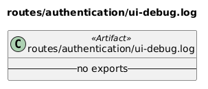               | Source: [`src/routes/authentication/ui-debug.log.puml`](src/routes/authentication/ui-debug.log.puml) Diagram ID: `routes__authentication__ui_debug_log` Stereotype: `Artifact`                      |

src/routes/dashboard (2 diagrams)

| Diagram                          | Preview                                                                                          | Details                                                                                                                                                                                |
| -------------------------------- | ------------------------------------------------------------------------------------------------ | -------------------------------------------------------------------------------------------------------------------------------------------------------------------------------------- |
| routes/dashboard/+page.server.ts | 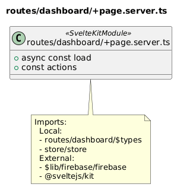 | Source: [`src/routes/dashboard/+page.server.ts.puml`](src/routes/dashboard/+page.server.ts.puml) Diagram ID: `routes__dashboard__page_server_ts` Stereotype: `SvelteKitModule` |
| routes/dashboard/+page.svelte    | 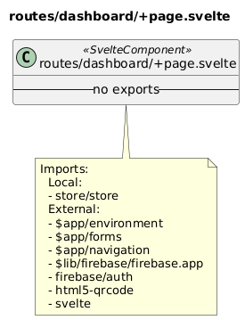       | Source: [`src/routes/dashboard/+page.svelte.puml`](src/routes/dashboard/+page.svelte.puml) Diagram ID: `routes__dashboard__page_svelte` Stereotype: `SvelteComponent`          |

src/routes/dashboard/[id] (1 diagram)

| Diagram                            | Preview                                                                                                   | Details                                                                                                                                                                                      |
| ---------------------------------- | --------------------------------------------------------------------------------------------------------- | -------------------------------------------------------------------------------------------------------------------------------------------------------------------------------------------- |
| routes/dashboard/[id]/+page.svelte | 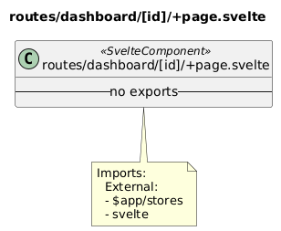 | Source: [`src/routes/dashboard/[id]/+page.svelte.puml`](src/routes/dashboard/[id]/+page.svelte.puml) Diagram ID: `routes__dashboard__id___page_svelte` Stereotype: `SvelteComponent` |

src/routes/initialSurvey (2 diagrams)

| Diagram                              | Preview                                                                                                      | Details                                                                                                                                                                                            |
| ------------------------------------ | ------------------------------------------------------------------------------------------------------------ | -------------------------------------------------------------------------------------------------------------------------------------------------------------------------------------------------- |
| routes/initialSurvey/+page.server.ts | 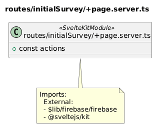 | Source: [`src/routes/initialSurvey/+page.server.ts.puml`](src/routes/initialSurvey/+page.server.ts.puml) Diagram ID: `routes__initialSurvey__page_server_ts` Stereotype: `SvelteKitModule` |
| routes/initialSurvey/+page.svelte    | 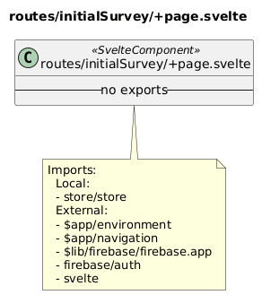       | Source: [`src/routes/initialSurvey/+page.svelte.puml`](src/routes/initialSurvey/+page.svelte.puml) Diagram ID: `routes__initialSurvey__page_svelte` Stereotype: `SvelteComponent`          |

src/store (1 diagram)

| Diagram        | Preview                                           | Details                                                                                                                 |
| -------------- | ------------------------------------------------- | ----------------------------------------------------------------------------------------------------------------------- |
| store/store.ts | 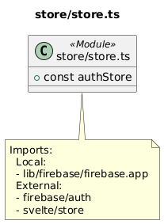 | Source: [`src/store/store.ts.puml`](src/store/store.ts.puml) Diagram ID: `store__store_ts` Stereotype: `Module` |

<!-- DIAGRAM-LIST:END -->
