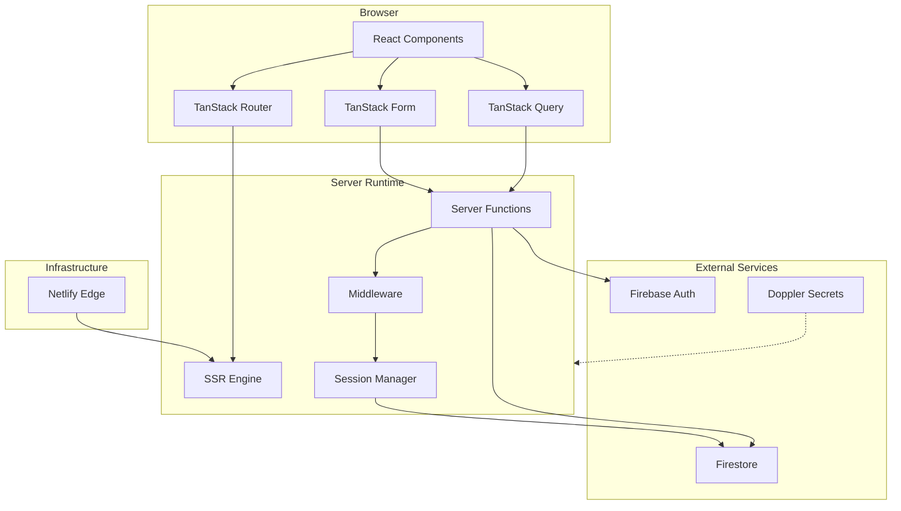
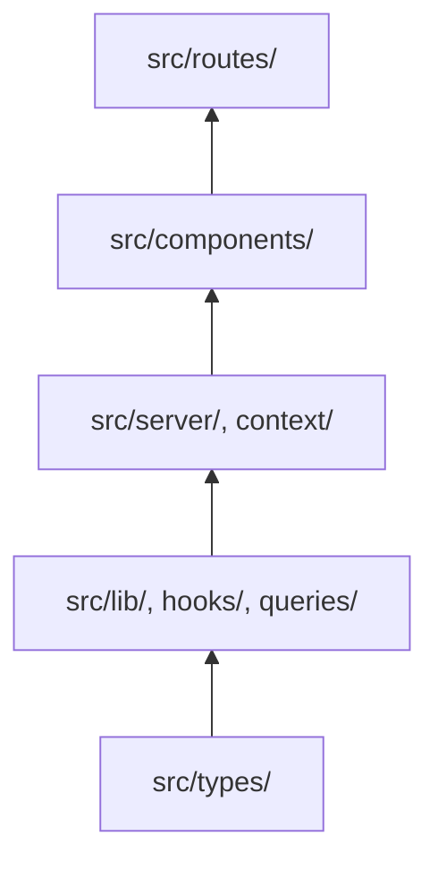
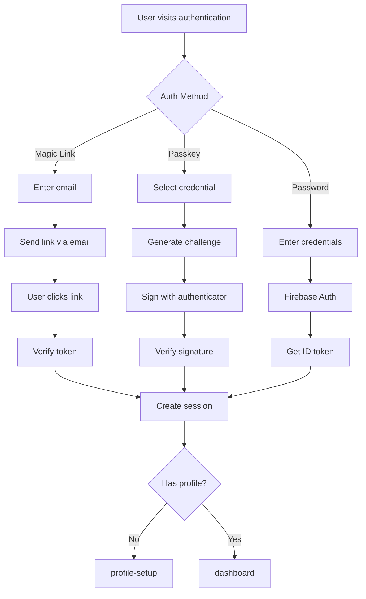
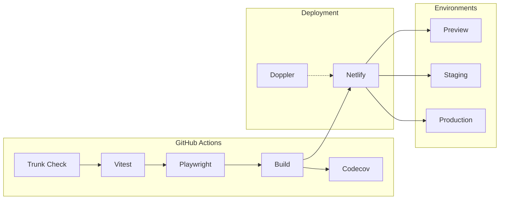

# System Visual Overview

## System Architecture

Client layer (React/TanStack), Server layer (SSR/Functions), External services (Firebase), Infrastructure (Netlify)

## Layer Dependencies

Import direction: types → lib/hooks → server/context → components → routes

## Authentication Flows

Magic link and passkey authentication sequences with session lifecycle

## Data Model

Firestore collections and relationships: users, events, surveys, and responses

## Request Lifecycle

HTTP request through Netlify Edge to server function to Firestore

## CI/CD Pipeline

GitHub Actions workflow: Trunk Check → Tests → Build → Deploy

---

_For detailed documentation, see [Dev Notes](01-initialize)_

_For project overview and reading paths, see [Home](Home)_
