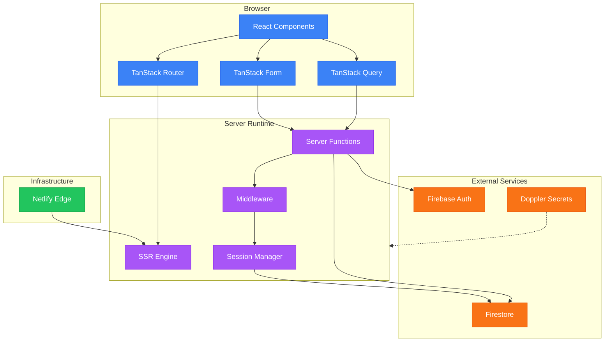
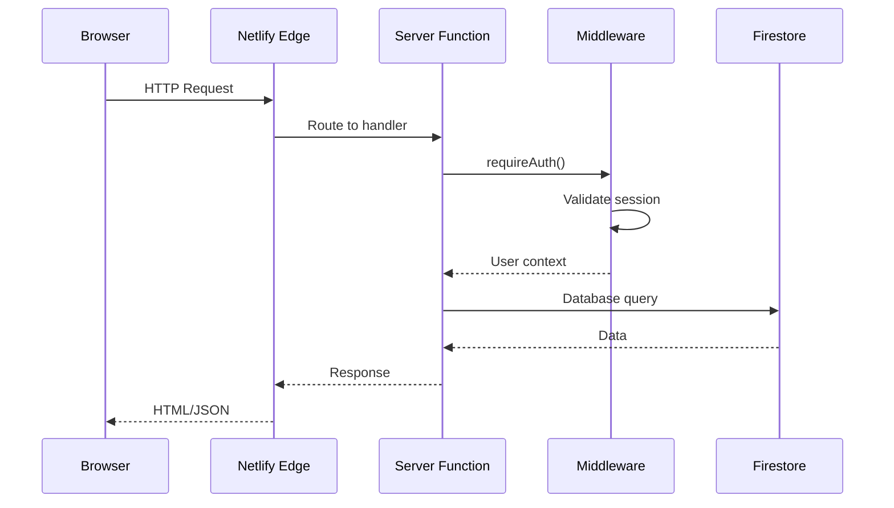
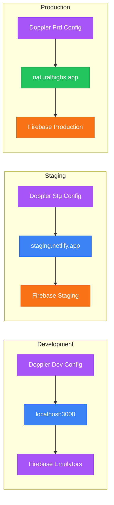

# Architecture

System overview of Natural-Highs

## System Diagram



## Tech Stack

### Core Framework

| Package | Purpose |
|---------|---------|
| TanStack Start | Full-stack React framework with SSR |
| React 19 | UI library with concurrent features |
| TypeScript | Type-safe JavaScript |
| Vite | Build tool and dev server |

### TanStack Ecosystem

| Package | Purpose |
|---------|---------|
| TanStack Router | File-based routing with type safety |
| TanStack Query | Server state management and caching |
| TanStack Form | Form state with validation |
| TanStack Table | Data tables with virtualization |

### Backend

| Service | Purpose |
|---------|---------|
| Firebase Auth | User authentication |
| Firestore | NoSQL database |
| Doppler | Secrets management |

### Infrastructure

| Service | Purpose |
|---------|---------|
| Netlify | Hosting and edge functions |
| GitHub Actions | CI/CD pipeline |

## Request Flow



## Project Structure

```text
src/
├── routes/                 # File-based routing
│   ├── __root.tsx         # Root layout, providers
│   ├── _authed.tsx        # Protected route layout
│   ├── _authed/_admin/    # Admin routes
│   ├── index.tsx          # Home page
│   └── authentication.tsx # Login page
│
├── components/
│   ├── ui/                # Primitives (Button, Card, etc.)
│   ├── forms/             # Form components
│   ├── auth/              # Auth UI (PasskeySignIn, etc.)
│   ├── admin/             # Admin components
│   ├── session/           # Session UI
│   └── Layout.tsx         # Main layout
│
├── server/
│   ├── functions/         # Server functions (RPC)
│   │   ├── auth.ts       # Session management
│   │   ├── passkeys.ts   # WebAuthn
│   │   ├── profile.ts    # User profiles
│   │   └── utils/        # Error classes
│   ├── middleware/        # Auth guards
│   └── schemas/           # Zod validation
│
├── lib/
│   ├── firebase/          # Firebase clients
│   │   ├── firebase.ts   # Client SDK
│   │   └── firebase.admin.ts # Admin SDK
│   ├── session.ts         # Session helpers
│   ├── auth/              # Auth utilities
│   └── queries/           # Query options
│
├── context/
│   └── AuthContext.tsx    # Client auth state
│
└── types/                 # TypeScript types
```

## Key Patterns

### Server Functions

All backend logic runs in server functions - never in components.

```typescript
// src/server/functions/example.ts
export const getData = createServerFn({method: 'GET'})
  .handler(async () => {
    const user = await requireAuth()
    return db.collection('data').get()
  })
```

Components call server functions like regular async functions:

```typescript
// src/routes/page.tsx
const data = await getData()
```

### State Ownership

| State Type | Owner | Access |
|------------|-------|--------|
| Server data | TanStack Query | `useQuery()` |
| Form state | TanStack Form | `useForm()` |
| Auth state | AuthContext | `useAuth()` |
| UI state | React useState | Local only |

### Route Guards

Protected routes use `beforeLoad` to check authentication:

```typescript
// src/routes/_authed.tsx
export const Route = createFileRoute('/_authed')({
  beforeLoad: ({context}) => {
    if (!context.auth.isAuthenticated) {
      throw redirect({to: '/authentication'})
    }
  }
})
```

## Environment Architecture



## Data Flow Layers

```text
┌─────────────────────────────────────────────────────────┐
│                    UI Layer                             │
│  Components → TanStack Form → TanStack Query            │
├─────────────────────────────────────────────────────────┤
│                  Transport Layer                        │
│  Server Functions (RPC) → HTTP                          │
├─────────────────────────────────────────────────────────┤
│                 Validation Layer                        │
│  Zod Schemas → Type Guards                              │
├─────────────────────────────────────────────────────────┤
│                   Auth Layer                            │
│  Middleware → Session → Firebase Auth                   │
├─────────────────────────────────────────────────────────┤
│                   Data Layer                            │
│  Firestore → Firebase Admin SDK                         │
└─────────────────────────────────────────────────────────┘
```

## Configuration Files

| File | Purpose |
|------|---------|
| `vite.config.ts` | Build configuration |
| `tsconfig.json` | TypeScript settings |
| `biome.json` | Linting and formatting |
| `playwright.config.ts` | E2E test configuration |
| `vitest.config.ts` | Unit test configuration |
| `firebase.json` | Emulator configuration |
| `netlify.toml` | Deployment settings |

---

_Previous: [Getting Started](01-initialize) | Next: [Authentication](03-authentication)_
