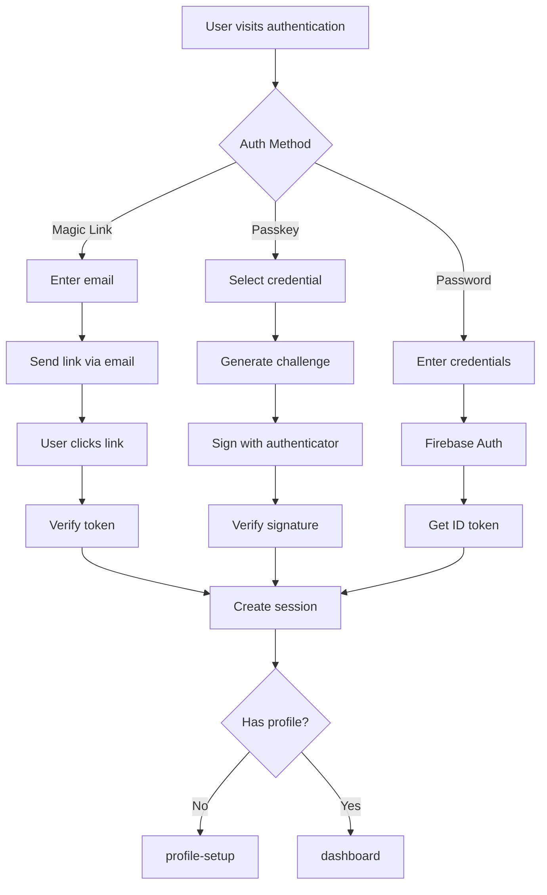
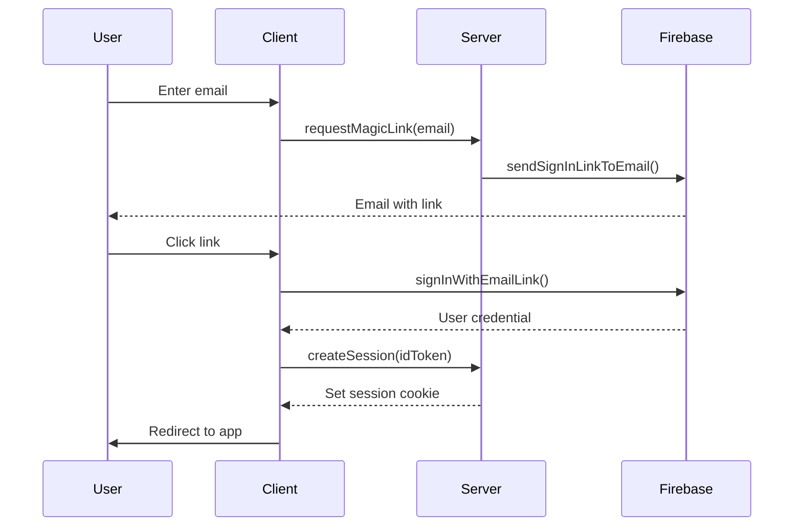
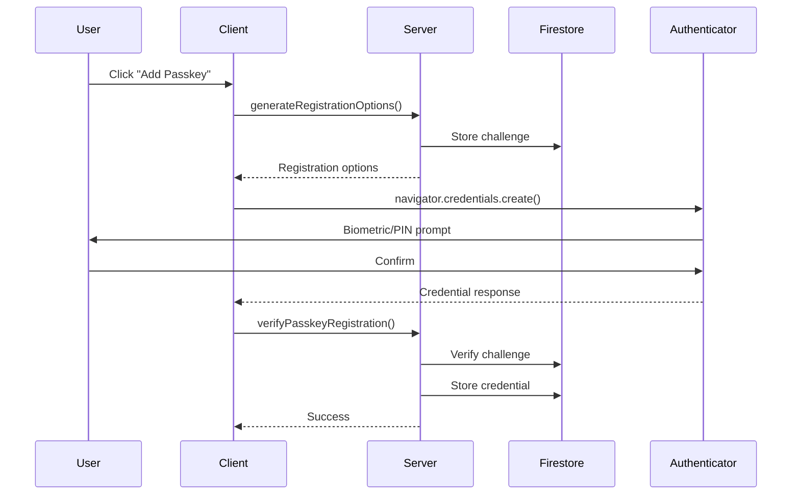
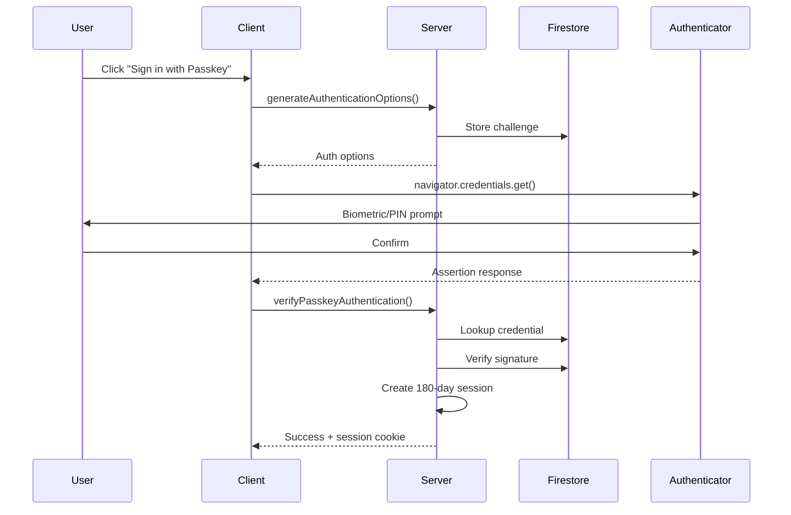
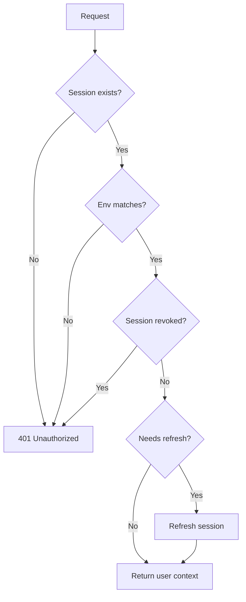

# Authentication

Natural-Highs supports three authentication methods: Magic Link, Passkey (WebAuthn), and Email/Password.

## Authentication Flow Overview



## Session Management

Sessions use HTTP-only cookies managed by TanStack Start's `useSession()`.

### Session Data Structure

```typescript
type SessionData = {
  userId?: string
  email?: string
  displayName?: string
  claims?: {
    admin?: boolean
    signedConsentForm?: boolean
    passkeyEnabled?: boolean
    profileComplete?: boolean
    isMinor?: boolean
  }
  env?: 'development' | 'staging' | 'production'
  sessionCreatedAt?: string
}
```

### Session Functions

Located in `src/lib/session.ts`:

| Function | Purpose |
|----------|---------|
| `useAppSession()` | Get current session (server-only) |
| `getSessionData()` | Read session without encryption overhead |
| `updateSession(data)` | Partial session update |
| `clearSession()` | Logout - remove session |
| `createPasskeySession(data)` | Extended 180-day session |

### Session Security

| Feature | Purpose |
|---------|---------|
| HTTP-only | Prevents JavaScript access (XSS protection) |
| Secure flag | HTTPS-only in production |
| SameSite=lax | CSRF protection |
| Environment binding | Prevents cross-env replay |
| Creation timestamp | Enables revocation checks |

## Magic Link Authentication

Passwordless authentication via email.



### Implementation

```typescript
// Client: Request link
import {sendSignInLinkToEmail} from 'firebase/auth'

await sendSignInLinkToEmail(auth, email, {
  url: `${window.location.origin}/magic-link`,
  handleCodeInApp: true
})

// Client: Complete sign-in (on /magic-link page)
import {signInWithEmailLink} from 'firebase/auth'

const result = await signInWithEmailLink(auth, email, window.location.href)
const idToken = await result.user.getIdToken()
await createSessionFn({data: {idToken}})
```

## Passkey (WebAuthn) Authentication

Phishing-resistant authentication using device authenticators.

### Registration Flow



### Authentication Flow



### Passkey Storage

```text
Firestore Collections:

users/{uid}/passkeys/{credentialId}
  - credentialId: string
  - publicKeyBytes: Uint8Array
  - signCount: number
  - transports: string[]
  - createdAt: Timestamp

passkeyCredentials/{credentialId}
  - userId: string
  (Index for O(1) lookup during auth)

passkeyChallenges/{challengeId}
  - challenge: string
  - type: 'registration' | 'authentication'
  - createdAt: Timestamp
  (TTL: 5 minutes)
```

## Auth Guards (Middleware)

Server functions use guard functions to validate authentication.

### Available Guards

```typescript
// Basic auth - validates session
const user = await requireAuth()

// Full validation - all security checks
const user = await requireAuthFull()

// Admin only - validates admin claim
const user = await requireAdmin()

// Consent required
const user = await requireConsent()
```

### Guard Validation Chain



### Using Guards in Server Functions

```typescript
// src/server/functions/example.ts
import {requireAuth, requireAdmin} from '../middleware/auth'

// Any authenticated user
export const getUserData = createServerFn({method: 'GET'})
  .handler(async () => {
    const user = await requireAuth()
    return db.collection('users').doc(user.uid).get()
  })

// Admin only
export const getAllUsers = createServerFn({method: 'GET'})
  .handler(async () => {
    await requireAdmin()
    return db.collection('users').get()
  })
```

## Client-Side Auth Context

The `AuthContext` provides client-side auth state.

### Usage

```typescript
import {useAuth} from '@/context/AuthContext'

function MyComponent() {
  const {user, loading, admin, consentForm} = useAuth()

  if (loading) return <Spinner />
  if (!user) return <Redirect to="/authentication" />

  return <div>Welcome, {user.displayName}</div>
}
```

### Available Properties

| Property | Type | Description |
|----------|------|-------------|
| `user` | User \| null | Firebase user object |
| `loading` | boolean | Auth state loading |
| `admin` | boolean | Has admin claim |
| `consentForm` | boolean | Has signed consent |

## Session Revocation

Sessions can be invalidated server-side.

### Revocation Events

```typescript
// Store revocation event
await db.collection('sessionRevocations').add({
  userId: uid,
  revokedAt: FieldValue.serverTimestamp(),
  reason: 'passkey_removed' | 'credential_change' | 'admin_action'
})
```

### Automatic Revocation

Sessions are automatically invalidated when:
- User removes a passkey
- Admin force-logouts user
- Firebase `tokensValidAfterTime` changes
- Environment mismatch detected

## Custom Claims

Firebase custom claims control authorization.

### Available Claims

| Claim | Purpose |
|-------|---------|
| `admin` | Admin access |
| `signedConsentForm` | Completed consent |
| `passkeyEnabled` | Has registered passkey |
| `profileComplete` | Completed profile setup |
| `isMinor` | User is under 18 |

### Setting Claims (Server-only)

```typescript
import {adminAuth} from '$lib/firebase/firebase.admin'

await adminAuth.setCustomUserClaims(uid, {
  admin: true,
  profileComplete: true
})
```

---

_Previous: [Architecture](02-architecture) | Next: [Data Layer](04-data-layer)_
