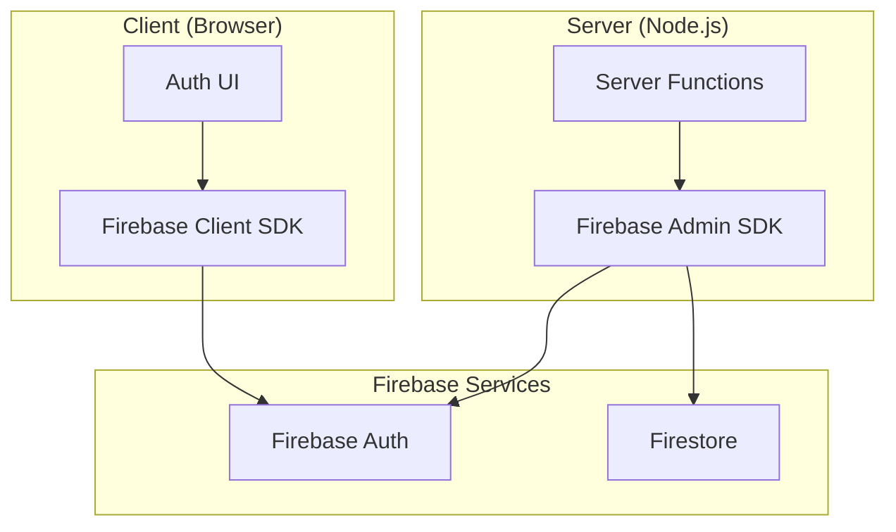
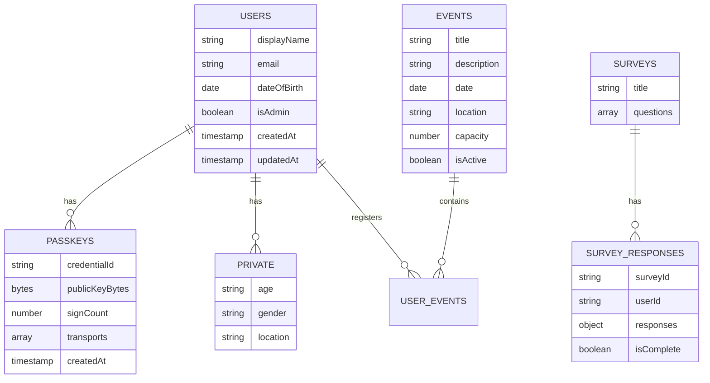

# Data Layer

Firebase provides authentication and Firestore for data persistence.
This document covers database patterns and Firebase integration.

## Firebase Architecture



## Firebase Clients

### Client SDK

Used in browser for authentication only.

```typescript
// src/lib/firebase/firebase.ts
import {initializeApp} from 'firebase/app'
import {getAuth} from 'firebase/auth'

const app = initializeApp({
  apiKey: import.meta.env.VITE_APIKEY,
  authDomain: import.meta.env.VITE_AUTH_DOMAIN,
  projectId: import.meta.env.VITE_PROJECT_ID
  // ...
})

export const auth = getAuth(app)
```

### Admin SDK

Used in server functions for all database operations.

```typescript
// src/lib/firebase/firebase.admin.ts
import {initializeApp, cert} from 'firebase-admin/app'
import {getFirestore} from 'firebase-admin/firestore'
import {getAuth} from 'firebase-admin/auth'

// Lazy initialization
let _db: Firestore | null = null

export const adminDb = () => {
  if (!_db) {
    const app = initializeApp({
      credential: cert(JSON.parse(process.env.FIREBASE_SERVICE_ACCOUNT))
    })
    _db = getFirestore(app)
  }
  return _db
}
```

## Firestore Collections



### Collection Paths

| Collection | Path | Purpose |
|------------|------|---------|
| Users | `users/{uid}` | User profiles |
| Passkeys | `users/{uid}/passkeys/{credentialId}` | WebAuthn credentials |
| Private | `users/{uid}/private/{docId}` | Minor demographics (isolated) |
| Passkey Index | `passkeyCredentials/{credentialId}` | O(1) credential lookup |
| Challenges | `passkeyChallenges/{challengeId}` | WebAuthn challenges (5m TTL) |
| Revocations | `sessionRevocations/{id}` | Session invalidation events |
| Events | `events/{eventId}` | Event definitions |
| User Events | `userEvents/{id}` | Event registrations |
| Surveys | `surveys/{surveyId}` | Survey definitions |
| Responses | `surveyResponses/{id}` | Survey responses |

## Data Patterns

### Read Pattern

Always use the Admin SDK in server functions:

```typescript
// src/server/functions/users.ts
export const getUser = createServerFn({method: 'GET'})
  .handler(async ({data}) => {
    const user = await requireAuth()
    const doc = await adminDb()
      .collection('users')
      .doc(user.uid)
      .get()

    if (!doc.exists) {
      throw new NotFoundError('User not found')
    }

    return doc.data()
  })
```

### Write Pattern

Validate before write, convert timestamps on read:

```typescript
export const updateProfile = createServerFn({method: 'POST'})
  .handler(async ({data}) => {
    const user = await requireAuth()
    const validated = profileSchema.parse(data)

    await adminDb()
      .collection('users')
      .doc(user.uid)
      .update({
        ...validated,
        updatedAt: FieldValue.serverTimestamp()
      })

    return {success: true}
  })
```

### Timestamp Conversion

Firestore Timestamps must be converted for API responses:

```typescript
// WRONG - Returns Firestore Timestamp object
return doc.data()

// CORRECT - Convert for transport
const data = doc.data()
return {
  ...data,
  createdAt: data.createdAt?.toDate?.()?.toISOString() ?? data.createdAt,
  updatedAt: data.updatedAt?.toDate?.()?.toISOString() ?? data.updatedAt
}
```

### Batch Operations

Use batches for atomic multi-document writes:

```typescript
const batch = adminDb().batch()

batch.set(userRef, userData)
batch.set(profileRef, profileData)
batch.update(statsRef, {count: FieldValue.increment(1)})

await batch.commit()
```

### Transactions

Use transactions for read-then-write operations:

```typescript
await adminDb().runTransaction(async (transaction) => {
  const doc = await transaction.get(eventRef)
  const current = doc.data()

  if (current.registrations >= current.capacity) {
    throw new ConflictError('Event is full')
  }

  transaction.update(eventRef, {
    registrations: FieldValue.increment(1)
  })
})
```

## Query Patterns

### Basic Query

```typescript
const snapshot = await adminDb()
  .collection('events')
  .where('isActive', '==', true)
  .orderBy('date', 'asc')
  .limit(10)
  .get()

const events = snapshot.docs.map(doc => ({
  id: doc.id,
  ...doc.data()
}))
```

### Compound Query

```typescript
const snapshot = await adminDb()
  .collection('userEvents')
  .where('userId', '==', uid)
  .where('eventDate', '>=', new Date())
  .get()
```

### Subcollection Query

```typescript
// Get all passkeys for a user
const passkeys = await adminDb()
  .collection('users')
  .doc(uid)
  .collection('passkeys')
  .get()
```

## TanStack Query Integration

### Query Options Pattern

```typescript
// src/lib/queries/events.ts
import {queryOptions} from '@tanstack/react-query'
import {getEvents} from '@/server/functions/events'

export const eventsQueryOptions = () =>
  queryOptions({
    queryKey: ['events'] as const,
    queryFn: () => getEvents()
  })

export const eventQueryOptions = (id: string) =>
  queryOptions({
    queryKey: ['events', 'byId', id] as const,
    queryFn: () => getEvent({data: {id}})
  })
```

### Using in Components

```typescript
import {useQuery} from '@tanstack/react-query'
import {eventsQueryOptions} from '@/lib/queries/events'

function EventList() {
  const {data, isPending, error} = useQuery(eventsQueryOptions())

  if (isPending) return <Skeleton />
  if (error) return <Error message={error.message} />

  return (
    <ul>
      {data.map(event => (
        <li key={event.id}>{event.title}</li>
      ))}
    </ul>
  )
}
```

### Cache Invalidation

```typescript
import {useQueryClient} from '@tanstack/react-query'

function CreateEvent() {
  const queryClient = useQueryClient()

  const handleCreate = async () => {
    await createEvent({data: formData})
    // Invalidate events list
    queryClient.invalidateQueries({queryKey: ['events']})
  }
}
```

## Zod Validation

All data is validated with Zod before database operations.

### Schema Definition

```typescript
// src/server/schemas/profile.ts
import {z} from 'zod'

export const profileSchema = z.object({
  displayName: z.string().min(2).max(50),
  dateOfBirth: z.string().date()
})

export type ProfileData = z.infer<typeof profileSchema>
```

### Usage in Server Functions

```typescript
export const createProfile = createServerFn({method: 'POST'})
  .handler(async ({data}) => {
    const validated = profileSchema.parse(data)
    // validated is now type-safe
  })
```

## Emulator Support

Local development uses Firebase emulators.

### Configuration

```typescript
// src/lib/firebase/firebase.ts
if (import.meta.env.VITE_USE_EMULATORS === 'true') {
  connectAuthEmulator(auth, 'http://127.0.0.1:9099')
}

// src/lib/firebase/firebase.admin.ts
if (process.env.USE_EMULATORS === 'true') {
  process.env.FIRESTORE_EMULATOR_HOST = '127.0.0.1:8080'
}
```

### Running Emulators

```bash
bun run emulators
```

Starts:
- Auth emulator on port 9099
- Firestore emulator on port 8080
- UI at <http://localhost:4000>

---

_Previous: [Authentication](03-authentication) | Next: [Routing](05-routing)_
