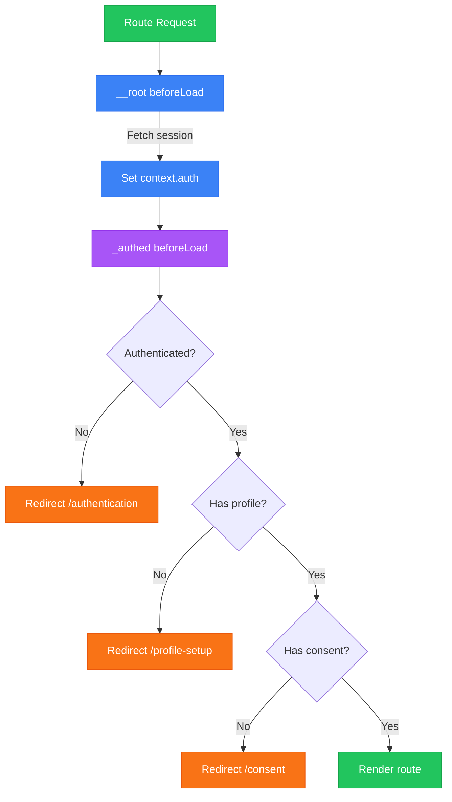

# Routing

TanStack Router with file-based routing.
Routes are type-safe and support SSR.

## Route Structure

```mermaid
flowchart TB
    ROOT["__root.tsx"]

    ROOT --> PUBLIC
    ROOT --> AUTHED

    subgraph PUBLIC["Public Routes"]
        direction TB
        HOME["index"]
        AUTH_PAGE["authentication"]
        GUEST["guest"]
        MAGIC["magic-link"]
        SIGNUP["signup/about-you"]
    end

    subgraph AUTHED["_authed.tsx (Auth Guard)"]
        direction TB
        PROFILE_SETUP["profile-setup"]
        CONSENT["consent"]
        DASHBOARD["dashboard"]
        PROFILE["profile"]
        SETTINGS["settings/profile"]
        ADMIN
    end

    subgraph ADMIN["_admin.tsx (Admin Guard)"]
        direction TB
        ADMIN_DASH["admin-dashboard"]
        USERS["users"]
        EVENTS["events"]
    end

    style ROOT fill:#22c55e,stroke:#16a34a,color:#fff
    style HOME fill:#3b82f6,stroke:#2563eb,color:#fff
    style AUTH_PAGE fill:#3b82f6,stroke:#2563eb,color:#fff
    style GUEST fill:#3b82f6,stroke:#2563eb,color:#fff
    style MAGIC fill:#3b82f6,stroke:#2563eb,color:#fff
    style SIGNUP fill:#3b82f6,stroke:#2563eb,color:#fff
    style PROFILE_SETUP fill:#a855f7,stroke:#9333ea,color:#fff
    style CONSENT fill:#a855f7,stroke:#9333ea,color:#fff
    style DASHBOARD fill:#a855f7,stroke:#9333ea,color:#fff
    style PROFILE fill:#a855f7,stroke:#9333ea,color:#fff
    style SETTINGS fill:#a855f7,stroke:#9333ea,color:#fff
    style ADMIN_DASH fill:#f97316,stroke:#ea580c,color:#fff
    style USERS fill:#f97316,stroke:#ea580c,color:#fff
    style EVENTS fill:#f97316,stroke:#ea580c,color:#fff
```



## File Naming Conventions

| Pattern | Meaning | Example |
|---------|---------|---------|
| `__root.tsx` | Root layout (wraps all routes) | Providers, global layout |
| `_layout.tsx` | Layout group prefix | `_authed.tsx` wraps auth routes |
| `index.tsx` | Index route | `/dashboard/index.tsx` → `/dashboard` |
| `$param.tsx` | Dynamic segment | `$eventId.tsx` → `/events/:eventId` |
| `$.tsx` | Catch-all | `$.tsx` matches any path |

## Route Files Location

```text
src/routes/
├── __root.tsx              # Root layout
├── index.tsx               # / (home)
├── authentication.tsx      # /authentication
├── guest.tsx               # /guest
├── magic-link.tsx          # /magic-link
├── signup/
│   └── about-you.tsx       # /signup/about-you
├── _authed.tsx             # Protected layout
├── _authed/
│   ├── profile-setup.tsx   # /profile-setup
│   ├── consent.tsx         # /consent
│   ├── dashboard.tsx       # /dashboard
│   ├── profile.tsx         # /profile
│   ├── settings/
│   │   └── profile.tsx     # /settings/profile
│   └── _admin.tsx          # Admin layout
│   └── _admin/
│       ├── admin-dashboard.tsx
│       ├── users.tsx
│       └── events.tsx
└── api/                    # API routes
    └── auth/
        └── sessionLogin.ts
```

## Creating Routes

### Basic Route

```typescript
// src/routes/about.tsx
import {createFileRoute} from '@tanstack/react-router'

export const Route = createFileRoute('/about')({
  component: AboutPage
})

function AboutPage() {
  return <div>About Natural-Highs</div>
}
```

### Route with Loader

```typescript
// src/routes/_authed/dashboard.tsx
import {createFileRoute} from '@tanstack/react-router'

export const Route = createFileRoute('/_authed/dashboard')({
  loader: async ({context}) => {
    // Runs on server during SSR
    return await getUserData()
  },
  component: DashboardPage
})

function DashboardPage() {
  const data = Route.useLoaderData()
  return <div>{data.name}</div>
}
```

### Dynamic Route

```typescript
// src/routes/_authed/events/$eventId.tsx
import {createFileRoute} from '@tanstack/react-router'

export const Route = createFileRoute('/_authed/events/$eventId')({
  loader: async ({params}) => {
    return await getEvent({data: {id: params.eventId}})
  },
  component: EventPage
})

function EventPage() {
  const {eventId} = Route.useParams()
  const event = Route.useLoaderData()
  return <div>{event.title}</div>
}
```

## Route Guards

### Layout Route Pattern

Layout routes (`_authed.tsx`) wrap child routes and provide guards.

```typescript
// src/routes/_authed.tsx
import {createFileRoute, redirect, Outlet} from '@tanstack/react-router'

export const Route = createFileRoute('/_authed')({
  beforeLoad: async ({context, location}) => {
    const {isAuthenticated, hasProfile, hasConsent} = context.auth

    if (!isAuthenticated) {
      throw redirect({to: '/authentication', search: {redirect: location.href}})
    }

    if (!hasProfile && location.pathname !== '/profile-setup') {
      throw redirect({to: '/profile-setup'})
    }

    if (!hasConsent && location.pathname !== '/consent') {
      throw redirect({to: '/consent'})
    }
  },
  component: AuthedLayout
})

function AuthedLayout() {
  return <Outlet />  // Renders child routes
}
```

### Guard Flow



## Root Route Context

The root route provides context to all routes.

```typescript
// src/routes/__root.tsx
import {createRootRouteWithContext} from '@tanstack/react-router'

interface RouterContext {
  auth: {
    isAuthenticated: boolean
    hasProfile: boolean
    hasConsent: boolean
    isAdmin: boolean
    userId?: string
  }
  queryClient: QueryClient
}

export const Route = createRootRouteWithContext<RouterContext>()({
  beforeLoad: async () => {
    const session = await getSessionForRoutesFn()
    return {
      auth: {
        isAuthenticated: !!session?.userId,
        hasProfile: !!session?.claims?.profileComplete,
        hasConsent: !!session?.claims?.signedConsentForm,
        isAdmin: !!session?.claims?.admin,
        userId: session?.userId
      }
    }
  },
  component: RootLayout
})
```

## Navigation

### Link Component

```typescript
import {Link} from '@tanstack/react-router'

// Basic link
<Link to="/dashboard">Dashboard</Link>

// With params
<Link to="/events/$eventId" params={{eventId: '123'}}>
  View Event
</Link>

// With search params
<Link to="/events" search={{filter: 'upcoming'}}>
  Upcoming Events
</Link>

// Active styling
<Link
  to="/dashboard"
  activeProps={{className: 'text-primary font-bold'}}
>
  Dashboard
</Link>
```

### Programmatic Navigation

```typescript
import {useNavigate, useRouter} from '@tanstack/react-router'

function MyComponent() {
  const navigate = useNavigate()
  const router = useRouter()

  // Navigate to route
  const goToDashboard = () => {
    navigate({to: '/dashboard'})
  }

  // Navigate with params
  const goToEvent = (id: string) => {
    navigate({to: '/events/$eventId', params: {eventId: id}})
  }

  // Invalidate and refetch
  const refresh = () => {
    router.invalidate()
  }
}
```

### Redirect

```typescript
import {redirect} from '@tanstack/react-router'

// In beforeLoad or loader
throw redirect({to: '/login'})

// With search params (for return URL)
throw redirect({
  to: '/authentication',
  search: {redirect: location.href}
})
```

## Search Params

### Defining Search Params

```typescript
// src/routes/_authed/events.tsx
import {createFileRoute} from '@tanstack/react-router'
import {z} from 'zod'

const searchSchema = z.object({
  filter: z.enum(['all', 'upcoming', 'past']).optional().default('all'),
  page: z.number().optional().default(1)
})

export const Route = createFileRoute('/_authed/events')({
  validateSearch: searchSchema,
  component: EventsPage
})

function EventsPage() {
  const {filter, page} = Route.useSearch()
  // filter and page are type-safe
}
```

### Updating Search Params

```typescript
import {useNavigate} from '@tanstack/react-router'

function FilterSelect() {
  const navigate = useNavigate()

  const setFilter = (value: string) => {
    navigate({
      search: (prev) => ({...prev, filter: value})
    })
  }
}
```

## API Routes

API routes handle server-side requests.

```typescript
// src/routes/api/auth/sessionLogin.ts
import {createAPIFileRoute} from '@tanstack/react-start/api'

export const APIRoute = createAPIFileRoute('/api/auth/sessionLogin')({
  POST: async ({request}) => {
    const body = await request.json()
    // Handle session creation
    return new Response(JSON.stringify({success: true}), {
      headers: {'Content-Type': 'application/json'}
    })
  }
})
```

## Route Hooks

### useRouterAuth

Access auth context in components:

```typescript
function useRouterAuth() {
  const context = Route.useRouteContext()
  return context.auth
}

function MyComponent() {
  const {isAuthenticated, isAdmin} = useRouterAuth()
}
```

### useMatch

Check current route:

```typescript
import {useMatch} from '@tanstack/react-router'

function Navbar() {
  const dashboardMatch = useMatch({from: '/_authed/dashboard'})
  const isOnDashboard = !!dashboardMatch
}
```

---

_Previous: [Data Layer](04-data-layer) | Next: [Server Functions](06-server-functions)_
