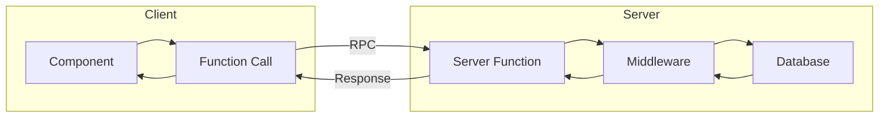

# Server Functions

Server functions are type-safe RPC endpoints that run on the server.
They replace traditional REST APIs with direct function calls.

## Overview



## Creating Server Functions

### Basic Pattern

```typescript
// src/server/functions/example.ts
import {createServerFn} from '@tanstack/react-start'

export const getData = createServerFn({method: 'GET'})
  .handler(async () => {
    return {message: 'Hello from server'}
  })
```

### With Input Validation

```typescript
import {createServerFn} from '@tanstack/react-start'
import {z} from 'zod'

const inputSchema = z.object({
  id: z.string().uuid(),
  name: z.string().min(2)
})

export const updateItem = createServerFn({method: 'POST'})
  .handler(async ({data}: {data: unknown}) => {
    const validated = inputSchema.parse(data)
    // validated is now type-safe
    return {success: true}
  })
```

### With Authentication

```typescript
import {createServerFn} from '@tanstack/react-start'
import {requireAuth} from '../middleware/auth'

export const getProfile = createServerFn({method: 'GET'})
  .handler(async () => {
    const user = await requireAuth()
    // user.uid is available
    return await fetchProfile(user.uid)
  })
```

## Server Function Anatomy

```typescript
export const myFunction = createServerFn({
  method: 'POST'  // HTTP method
})
.handler(async ({data}: {data: unknown}) => {
  // 1. Authentication
  const user = await requireAuth()

  // 2. Validation
  const validated = schema.parse(data)

  // 3. Business logic
  const result = await performAction(validated)

  // 4. Return response
  return {success: true, data: result}
})
```

## Middleware Functions

### requireAuth

Validates session and returns user context.

```typescript
export const requireAuth = async () => {
  const session = await useAppSession()

  if (!session.data.userId) {
    throw new AuthenticationError('Not authenticated')
  }

  // Environment binding check
  if (session.data.env !== getCurrentEnv()) {
    await clearSession()
    throw new AuthenticationError('Session environment mismatch')
  }

  return {
    uid: session.data.userId,
    email: session.data.email,
    claims: session.data.claims
  }
}
```

### requireAdmin

Validates admin privileges.

```typescript
export const requireAdmin = async () => {
  const user = await requireAuth()

  // Verify against Firebase (not just session claims)
  const fbUser = await adminAuth().getUser(user.uid)
  if (!fbUser.customClaims?.admin) {
    throw new AuthorizationError('Admin access required')
  }

  return user
}
```

### requireConsent

Validates consent form completion.

```typescript
export const requireConsent = async () => {
  const user = await requireAuth()

  if (!user.claims?.signedConsentForm) {
    throw new AuthorizationError('Consent form required')
  }

  return user
}
```

## Error Handling

### Custom Error Classes

```typescript
// src/server/functions/utils/errors.ts

export class ValidationError extends Error {
  status = 400
  constructor(message: string) {
    super(message)
    this.name = 'ValidationError'
  }
}

export class AuthenticationError extends Error {
  status = 401
  constructor(message: string) {
    super(message)
    this.name = 'AuthenticationError'
  }
}

export class AuthorizationError extends Error {
  status = 403
  constructor(message: string) {
    super(message)
    this.name = 'AuthorizationError'
  }
}

export class NotFoundError extends Error {
  status = 404
  constructor(message: string) {
    super(message)
    this.name = 'NotFoundError'
  }
}

export class ConflictError extends Error {
  status = 409
  constructor(message: string) {
    super(message)
    this.name = 'ConflictError'
  }
}
```

### Using Errors

```typescript
export const getEvent = createServerFn({method: 'GET'})
  .handler(async ({data}) => {
    const {id} = idSchema.parse(data)

    const doc = await adminDb().collection('events').doc(id).get()

    if (!doc.exists) {
      throw new NotFoundError(`Event ${id} not found`)
    }

    return doc.data()
  })
```

## Calling Server Functions

### From Components

```typescript
import {getData} from '@/server/functions/example'

function MyComponent() {
  const handleClick = async () => {
    const result = await getData()
    console.log(result)
  }

  return <button onClick={handleClick}>Fetch</button>
}
```

### With TanStack Query

```typescript
import {useQuery, useMutation} from '@tanstack/react-query'
import {getProfile, updateProfile} from '@/server/functions/profile'

function ProfilePage() {
  // Query
  const {data, isPending} = useQuery({
    queryKey: ['profile'],
    queryFn: () => getProfile()
  })

  // Mutation
  const mutation = useMutation({
    mutationFn: (data: ProfileData) => updateProfile({data}),
    onSuccess: () => {
      queryClient.invalidateQueries({queryKey: ['profile']})
    }
  })

  return (
    <form onSubmit={(e) => {
      e.preventDefault()
      mutation.mutate(formData)
    }}>
      {/* Form fields */}
    </form>
  )
}
```

### From Route Loaders

```typescript
// src/routes/_authed/profile.tsx
import {createFileRoute} from '@tanstack/react-router'
import {getProfile} from '@/server/functions/profile'

export const Route = createFileRoute('/_authed/profile')({
  loader: async () => {
    return await getProfile()
  },
  component: ProfilePage
})
```

## Server Functions by Domain

### Authentication (`auth.ts`)

| Function | Purpose |
|----------|---------|
| `createSessionFn` | Create session after Firebase auth |
| `getSessionForRoutesFn` | Get session for route guards |
| `refreshSessionFn` | Refresh session timestamp |
| `logoutFn` | Clear session |

### Passkeys (`passkeys.ts`)

| Function | Purpose |
|----------|---------|
| `generateRegistrationOptions` | Start passkey registration |
| `verifyPasskeyRegistration` | Complete registration |
| `generateAuthenticationOptions` | Start passkey auth |
| `verifyPasskeyAuthentication` | Complete auth |
| `listPasskeys` | Get user's passkeys |
| `deletePasskey` | Remove passkey |

### Profile (`profile.ts`)

| Function | Purpose |
|----------|---------|
| `createProfileFn` | Initial profile setup |
| `getProfileFn` | Get user profile |
| `updateProfileFn` | Update profile |
| `getDemographics` | Get demographics |
| `updateDemographics` | Update demographics |

### Events (`events.ts`)

| Function | Purpose |
|----------|---------|
| `getEvents` | List all events |
| `getEvent` | Get single event |
| `getUserEvents` | Get user's registrations |
| `registerForEvent` | Register for event |
| `validateEventQRCode` | Validate check-in code |

### Admin (`admin.ts`)

| Function | Purpose |
|----------|---------|
| `getAllUsers` | List all users |
| `getUser` | Get user details |
| `updateUserClaims` | Modify user claims |
| `forceLogoutUser` | Revoke user sessions |

## Best Practices

### Always Validate Input

```typescript
// WRONG
export const bad = createServerFn({method: 'POST'})
  .handler(async ({data}) => {
    // data is unknown, not validated
    await db.doc(data.id).update(data)
  })

// CORRECT
export const good = createServerFn({method: 'POST'})
  .handler(async ({data}) => {
    const validated = schema.parse(data)
    await db.doc(validated.id).update(validated)
  })
```

### Always Authenticate

```typescript
// WRONG - No auth check
export const bad = createServerFn({method: 'POST'})
  .handler(async ({data}) => {
    await db.collection('users').doc(data.userId).update(data)
  })

// CORRECT - Auth check + use session userId
export const good = createServerFn({method: 'POST'})
  .handler(async ({data}) => {
    const user = await requireAuth()
    await db.collection('users').doc(user.uid).update(data)
  })
```

### Convert Timestamps

```typescript
// WRONG - Returns Firestore Timestamp
export const bad = createServerFn({method: 'GET'})
  .handler(async () => {
    const doc = await db.doc('events/123').get()
    return doc.data()  // createdAt is Timestamp object
  })

// CORRECT - Convert for transport
export const good = createServerFn({method: 'GET'})
  .handler(async () => {
    const doc = await db.doc('events/123').get()
    const data = doc.data()
    return {
      ...data,
      createdAt: data.createdAt?.toDate?.()?.toISOString()
    }
  })
```

---

_Previous: [Routing](05-routing) | Next: [Components](07-components)_
