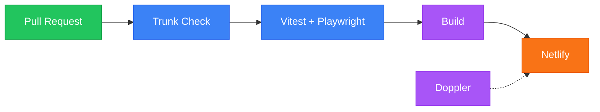

# Deployment

> **TL;DR**: Push to `main` triggers CI (lint, test, build) then auto-deploys to Netlify. Secrets via Doppler.

## Pipeline



## Quick Reference

| Action | Command |
|--------|---------|
| Preview deploy | `netlify deploy` |
| Production deploy | `netlify deploy --prod` |
| View secrets | `doppler secrets` |
| Run with secrets | `doppler run -- bun run dev` |
| Build for staging | `doppler run -c stg -- bun run build` |

## GitHub Actions

Workflow: [`.github/workflows/ci.yml`](../.github/workflows/ci.yml)

| Job | Purpose |
|-----|---------|
| lint | Trunk Check |
| test | Vitest + coverage → Codecov |
| e2e | Playwright + test analytics |
| build | Production build (requires all above) |

## Netlify

Config: [`netlify.toml`](../netlify.toml)

| Context | Trigger | Environment |
|---------|---------|-------------|
| Preview | PR opened | staging |
| Branch | Push to configured branch | staging |
| Production | Push to `main` | production |

<details>
<summary>CLI commands</summary>

```bash
# Link to site
netlify link

# Deploy preview
netlify deploy

# Deploy production
netlify deploy --prod

# Check status
netlify status

# View deploys
netlify deploys
```

</details>

## Doppler

Config: `doppler setup` links local env to project.

| Environment | Config | Usage |
|-------------|--------|-------|
| dev | `dev` | Local development |
| stg | `stg` | Staging deployment |
| prd | `prd` | Production deployment |

<details>
<summary>CLI commands</summary>

```bash
doppler login           # One-time auth
doppler setup           # Link project
doppler secrets         # View all
doppler secrets get KEY # View one
doppler run -- CMD      # Run with secrets
```

</details>

## Environment Variables

| Variable | Scope | Description |
|----------|-------|-------------|
| `VITE_*` | Client | Firebase config (public) |
| `SESSION_SECRET` | Server | Session encryption (32+ chars) |
| `FIREBASE_SERVICE_ACCOUNT` | Server | Admin SDK JSON |

## Rollback

**Via UI**: Deploys → Find previous → "Publish deploy"

**Via CLI**: `netlify deploy --prod --deploy-id <id>`

## Secret Rotation

```bash
# 1. Generate new secret
openssl rand -base64 32

# 2. Set rotation window
doppler secrets set SESSION_SECRET_PREVIOUS "$(doppler secrets get SESSION_SECRET --plain)"
doppler secrets set SESSION_SECRET "new-value"

# 3. Deploy, wait 24-48h, remove previous
doppler secrets delete SESSION_SECRET_PREVIOUS
```

---

_Previous: [Testing](08-testing) | Next: [Security](10-security)_
