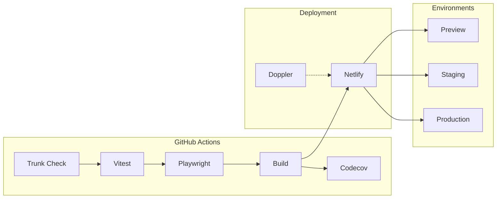

# Deployment

CI/CD via GitHub Actions, hosting on Netlify, secrets via Doppler.

## Pipeline Overview



## GitHub Actions

### Workflow File

`.github/workflows/ci.yml`

```yaml
name: CI

on:
  push:
    branches: [main]
  pull_request:
    branches: [main]

jobs:
  lint:
    runs-on: ubuntu-latest
    steps:
      - uses: actions/checkout@v4
      - uses: trunk-io/trunk-action@v1

  test:
    runs-on: ubuntu-latest
    steps:
      - uses: actions/checkout@v4
      - uses: oven-sh/setup-bun@v1
      - run: bun install
      - run: bun run test:ci
      - uses: codecov/codecov-action@v5
        with:
          token: ${{ secrets.CODECOV_TOKEN }}

  e2e:
    runs-on: ubuntu-latest
    steps:
      - uses: actions/checkout@v4
      - uses: oven-sh/setup-bun@v1
      - run: bun install
      - run: bunx playwright install --with-deps chromium
      - run: bun run test:e2e:ci
      - uses: codecov/test-results-action@v1
        with:
          token: ${{ secrets.CODECOV_TOKEN }}

  build:
    runs-on: ubuntu-latest
    needs: [lint, test, e2e]
    steps:
      - uses: actions/checkout@v4
      - uses: oven-sh/setup-bun@v1
      - run: bun install
      - run: bun run build
```

## Codecov Test Analytics

Test results are uploaded to Codecov for visibility and trend tracking.

### Features

- Test result history and trends
- Flaky test detection
- Test duration tracking
- PR comments with test summaries

### Configuration

```yaml
# codecov.yml
coverage:
  status:
    project:
      default:
        threshold: 1%
test_analytics:
  enabled: true
```

## Netlify

### Configuration

`netlify.toml`

```toml
[build]
  command = "bun run build"
  publish = "dist/client"

[dev]
  command = "bun run dev:bare"
  port = 3000

[[headers]]
  for = "/*"
  [headers.values]
    X-Frame-Options = "DENY"
    X-Content-Type-Options = "nosniff"
    Strict-Transport-Security = "max-age=31536000; includeSubDomains"
```

### Environment Variables

Set in Netlify UI or via CLI:

| Variable | Source | Description |
|----------|--------|-------------|
| `VITE_*` | Doppler | Firebase client config |
| `SESSION_SECRET` | Doppler | Session encryption |
| `FIREBASE_SERVICE_ACCOUNT` | Doppler | Admin SDK credentials |

### Deploy Commands

```bash
# Install Netlify CLI
bun add -g netlify-cli

# Link to site
netlify link

# Deploy preview
netlify deploy

# Deploy production
netlify deploy --prod
```

## Doppler

Secrets management for all environments.

### Setup

```bash
# Install CLI
brew install dopplerhq/cli/doppler

# Login
doppler login

# Configure project
doppler setup
```

### Environments

| Config | Usage |
|--------|-------|
| `dev` | Local development |
| `stg` | Staging deployment |
| `prd` | Production deployment |

### Usage

```bash
# Run with secrets
doppler run -- bun run dev

# Build with staging secrets
doppler run -c stg -- bun run build

# View secrets
doppler secrets

# Set secret
doppler secrets set API_KEY "value"
```

## Environment Variables

### Client-side (VITE_*)

Exposed to browser. Safe for public values.

| Variable | Description |
|----------|-------------|
| `VITE_APIKEY` | Firebase API key |
| `VITE_AUTH_DOMAIN` | Firebase auth domain |
| `VITE_PROJECT_ID` | Firebase project ID |
| `VITE_APP_URL` | Application URL |
| `VITE_USE_EMULATORS` | Enable emulators |

### Server-side

Never exposed to client.

| Variable | Description |
|----------|-------------|
| `SESSION_SECRET` | Session encryption (32+ chars) |
| `SESSION_SECRET_PREVIOUS` | Rotation window |
| `FIREBASE_SERVICE_ACCOUNT` | Admin SDK JSON |
| `USE_EMULATORS` | Server emulator flag |

## Build Scripts

| Script | Environment | Command |
|--------|-------------|---------|
| `build` | Default | `vite build` |
| `build:stg` | Staging | `doppler run -c stg -- vite build` |
| `build:prd` | Production | `doppler run -c prd -- vite build` |

## Deploy Contexts

### Preview Deploys

- Triggered on PRs
- Unique URL per PR
- Uses staging environment

### Branch Deploys

- Triggered on push to configured branches
- Persistent URL per branch

### Production

- Triggered on push to `main`
- Uses production environment
- Primary domain

## Monitoring

### Netlify Analytics

- Page views
- Bandwidth
- Top pages
- Geographic distribution

### Error Tracking

Errors captured via:
- Netlify Functions logs
- Browser console (production builds)

### Health Checks

```bash
# Check deployment status
netlify status

# View recent deploys
netlify deploys --json
```

## Rollback

### Via Netlify UI

1. Go to Deploys
2. Find previous successful deploy
3. Click "Publish deploy"

### Via CLI

```bash
# List deploys
netlify deploys

# Rollback to specific deploy
netlify deploy --prod --deploy-id <id>
```

## Secret Rotation

### Session Secret

```bash
# 1. Generate new secret
openssl rand -base64 32

# 2. Set previous secret (for rotation window)
doppler secrets set SESSION_SECRET_PREVIOUS "$(doppler secrets get SESSION_SECRET --plain)"

# 3. Set new secret
doppler secrets set SESSION_SECRET "new-secret-value"

# 4. Deploy
netlify deploy --prod

# 5. Wait 24-48 hours, then remove previous
doppler secrets delete SESSION_SECRET_PREVIOUS
```

---

_Previous: [Testing](08-testing) | Next: [Security](10-security)_
