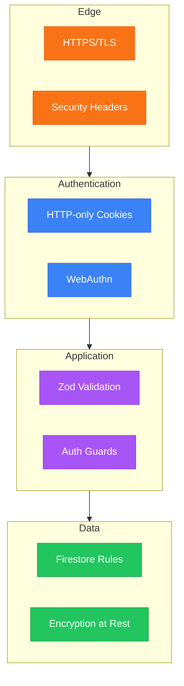

# Security

> **TL;DR**: HTTP-only session cookies, Firebase for auth/storage, Zod for input validation, Firestore rules for data isolation.

## Defense Layers



## Session Security

| Attribute | Value | Purpose |
|-----------|-------|---------|
| `httpOnly` | true | Prevents XSS token theft |
| `secure` | true (prod) | HTTPS only |
| `sameSite` | lax | CSRF protection |
| `maxAge` | 90 days | Session lifetime |

Session data: `{userId, email, claims, env, sessionCreatedAt}`

See [Authentication](03-authentication) for full session management details.

## Authorization

```typescript
// Validation chain
await requireAuth()              // Session exists
await requireAuthWithFirebaseCheck()  // + Firebase user exists
await requireAdmin()             // + Firebase admin claim
```

**Key principle**: Never trust session claims for sensitive operations. Always verify against Firebase:

```typescript
// WRONG: Trust session
if (session.claims.admin) { ... }

// CORRECT: Verify with Firebase
const user = await adminAuth().getUser(uid)
if (!user.customClaims?.admin) throw new AuthorizationError()
```

## Input Validation

All server function inputs validated with Zod:

```typescript
const schema = z.object({
  email: z.string().email(),
  name: z.string().min(2).max(50)
})

export const handler = createServerFn({method: 'POST'})
  .handler(async ({data}) => {
    const validated = schema.parse(data)  // Use validated, not data
  })
```

## Firestore Rules

Config: [`firestore.rules`](../firestore.rules)

| Pattern | Rule |
|---------|------|
| Own data | `request.auth.uid == userId` |
| Admin access | `request.auth.token.admin == true` |
| Server-only | `allow write: if false` |

<details>
<summary>Example rules</summary>

```javascript
match /users/{userId} {
  allow read, write: if request.auth.uid == userId;
}
match /users/{userId} {
  allow read, write: if request.auth.token.admin == true;
}
match /users/{userId}/private/{docId} {
  allow read: if request.auth.uid == userId || request.auth.token.admin;
  allow write: if false;  // Server-only
}
```

</details>

## HTTP Headers

Config: [`netlify.toml`](../netlify.toml)

| Header | Purpose |
|--------|---------|
| `X-Frame-Options: DENY` | Clickjacking prevention |
| `X-Content-Type-Options: nosniff` | MIME sniffing prevention |
| `Strict-Transport-Security` | Force HTTPS |
| `Content-Security-Policy` | XSS prevention |

## Secrets Management

All secrets in Doppler - never in code or `.env` files.

| Secret | Access |
|--------|--------|
| `SESSION_SECRET` | Server only |
| `FIREBASE_SERVICE_ACCOUNT` | Server only |
| `VITE_*` | Client + Server |

Rotation: See [Deployment](09-deployment#secret-rotation).

## Code Review Checklist

- [ ] Input validated with Zod
- [ ] Auth guard used
- [ ] No client-side auth decisions
- [ ] Error messages don't leak info
- [ ] No hardcoded secrets

---

_Previous: [Deployment](09-deployment) | Back to: [Home](Home)_
