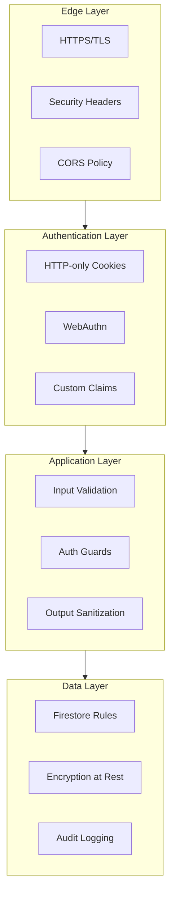

# Security

Development operations and project patterns.

## Defense Layers



## Session Security

### Cookie Configuration

| Attribute | Value | Purpose |
|-----------|-------|---------|
| `httpOnly` | true | Prevents XSS token theft |
| `secure` | true (prod) | HTTPS only |
| `sameSite` | lax | CSRF protection |
| `maxAge` | 90 days | Session lifetime |

### Session Data

```typescript
type SessionData = {
  userId: string
  email: string
  claims: {
    admin?: boolean
    signedConsentForm?: boolean
    passkeyEnabled?: boolean
  }
  env: 'development' | 'staging' | 'production'
  sessionCreatedAt: string  // For revocation checks
}
```

### Protections

| Threat | Mitigation |
|--------|------------|
| Session hijacking | HTTP-only cookies |
| Cross-env replay | Environment binding |
| Stale sessions | Revocation timestamp checks |
| Privilege escalation | Server-side claim validation |

## Authentication Security

### Magic Link

- Time-limited tokens (Firebase default)
- Single-use links
- Server-validated

### Passkey (WebAuthn)

- Phishing-resistant
- Challenge-response with nonce
- Server-stored credentials
- Extended session (180 days)

### Credential Storage

```text
Firestore:
  users/{uid}/passkeys/{credentialId}
    - publicKeyBytes (encrypted at rest)
    - signCount (replay detection)

  passkeyCredentials/{credentialId}
    - userId only (no secrets)
```

## Authorization

### Guard Functions

```typescript
// Validate session exists
await requireAuth()

// Validate against Firebase (not just session)
await requireAuthWithFirebaseCheck()

// Validate admin claim against Firebase
await requireAdmin()

// Full validation chain
await requireAuthFull()
```

### Validation Chain

1. Session exists with userId
2. Environment matches (dev/stg/prd)
3. Session not revoked
4. Firebase user exists
5. Firebase claims match (for admin)

### Claim Verification

```typescript
// WRONG: Trust session claims
if (session.claims.admin) {
  // Attacker could modify cookie
}

// CORRECT: Verify against Firebase
const fbUser = await adminAuth().getUser(uid)
if (!fbUser.customClaims?.admin) {
  throw new AuthorizationError('Not admin')
}
```

## Input Validation

### Zod Schemas

All server function inputs validated:

```typescript
const schema = z.object({
  email: z.string().email(),
  name: z.string().min(2).max(50),
  age: z.number().int().min(13).max(120)
})

export const handler = createServerFn({method: 'POST'})
  .handler(async ({data}) => {
    const validated = schema.parse(data)
    // Use validated, not data
  })
```

### Common Validations

| Field | Validation |
|-------|------------|
| Email | `z.string().email()` |
| UUID | `z.string().uuid()` |
| Date | `z.string().date()` |
| URL | `z.string().url()` |
| Enum | `z.enum(['a', 'b', 'c'])` |

## Firestore Security Rules

### User Data Isolation

```javascript
rules_version = '2';
service cloud.firestore {
  match /databases/{database}/documents {

    // Users can only access own data
    match /users/{userId} {
      allow read, write: if request.auth.uid == userId;
    }

    // Admin override
    match /users/{userId} {
      allow read, write: if request.auth.token.admin == true;
    }

    // Private subcollection (minors)
    match /users/{userId}/private/{docId} {
      allow read: if request.auth.uid == userId
                  || request.auth.token.admin == true;
      allow write: if false;  // Server-only
    }
  }
}
```

### Key Patterns

| Pattern | Rule |
|---------|------|
| Own data | `request.auth.uid == userId` |
| Admin access | `request.auth.token.admin == true` |
| Server-only | `allow write: if false` |
| Read-only | `allow read: if ...; allow write: if false` |

## HTTP Security Headers

Configured in `netlify.toml`:

| Header | Value | Purpose |
|--------|-------|---------|
| `X-Frame-Options` | DENY | Clickjacking prevention |
| `X-Content-Type-Options` | nosniff | MIME sniffing prevention |
| `Strict-Transport-Security` | max-age=31536000 | Force HTTPS |
| `Content-Security-Policy` | See below | XSS prevention |

### CSP Policy

```text
default-src 'self';
script-src 'self' 'unsafe-inline' https://apis.google.com;
style-src 'self' 'unsafe-inline';
img-src 'self' data: https:;
connect-src 'self' https://*.firebaseio.com https://*.googleapis.com;
frame-ancestors 'none';
```

## Secrets Management

### Storage

All secrets stored in Doppler:
- Never in code
- Never in .env files (gitignored)
- Environment-specific configs

### Access

| Secret | Access |
|--------|--------|
| `SESSION_SECRET` | Server functions only |
| `FIREBASE_SERVICE_ACCOUNT` | Server functions only |
| `VITE_*` | Client + Server |

### Rotation

```bash
# Generate new secret
openssl rand -base64 32

# Set rotation window
doppler secrets set SESSION_SECRET_PREVIOUS "$current"
doppler secrets set SESSION_SECRET "$new"

# Deploy, wait 24-48h, remove previous
doppler secrets delete SESSION_SECRET_PREVIOUS
```

## Privacy

### Data Isolation

Minor demographics stored in `/users/{uid}/private/`:
- Separate subcollection
- Stricter access rules
- Server-only writes

## Audit Trail

### Session Events

```typescript
// Revocation events
sessionRevocations/{id}
  - userId
  - revokedAt
  - reason: 'passkey_removed' | 'credential_change' | 'admin_action'
```

### Demographic History

```typescript
// Version history (server-only)
users/{uid}/demographicHistory/{versionId}
  - timestamp
  - data
  - reason
```

## Secure Development

### Pre-commit Checks

1. No secrets in code (`bun run lint`)
2. Input validation present
3. Auth guards used

### Code Review Checklist

- [ ] Input validated with Zod
- [ ] Auth guard used
- [ ] No client-side auth decisions
- [ ] Timestamps converted
- [ ] Error messages don't leak info
- [ ] No hardcoded secrets

### Dependency Management

```bash
# Update dependencies
bun update

# Check for outdated
bun outdated

# Audit dependencies
bun pm audit
```

---

_Previous: [Deployment](09-deployment) | Back to: [Overview](00-overview)_
